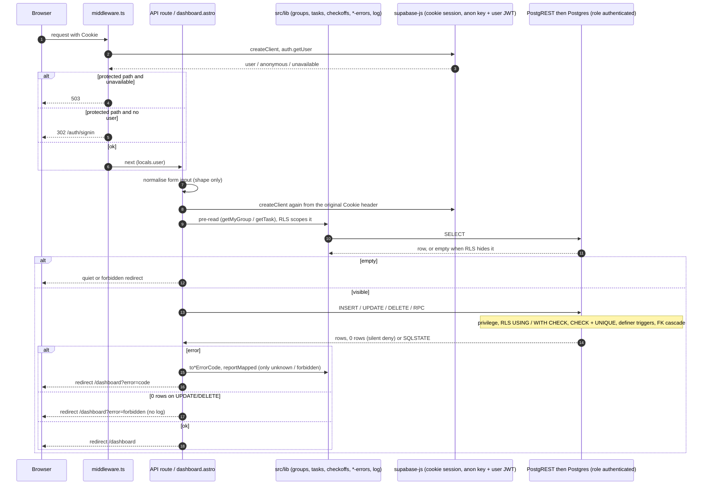

# Research: data-access (access to group and task data, enforced at the database level)

**Date**: 2026-10-05T16:41:51+02:00
**Researcher**: Claude (Sonnet 5.5) for Mariusz Złotucha
**Git Commit**: 6814f695c1ee6d0edf4fca192c594e29fd929b0e
**Branch**: feat/m4l3-feature-analysis (uncommitted at research time: `CLAUDE.md`, `.claude/.10x-cli-manifest.json`, this change folder)
**Repository**: streak-board

## Research Question

Analyse the flow "data-access" (risk zone #2 of `context/map/repo-map.md:81-82`, "Dostęp do danych grup i zadań (uprawnienia na poziomie bazy)") with attention to the areas the map ties to it. Three dimensions: (1) end-to-end trace from entry point through the layers to the DB read/write and back, with `file:line` steps and a Mermaid diagram; (2) test gaps on that path; (3) blast radius: what must change together (interface seam, generated layers, model, migrations, tests), combining the static graph with git co-change. Current state only; no recommendations and no code changes. The report has two explicit sections, **Feature overview** and **Technical debt**, and separates **evidence**, **inference** and **unknown**.

## Summary

- **Evidence.** Access to group and task data is decided in Postgres, not in the app. Every one of the 21 Supabase call sites in `src/` (18 `.from(...)`, 3 `.rpc(...)`: 10 in `src/lib`, 11 in `src/pages/api`, none in `dashboard.astro` or the components; ast-grep and grep agree, see section 4, V1) runs through the cookie-session client of `src/lib/supabase.ts:6-22`, and `src/` contains no service-role usage (grep `service_role|SERVICE_ROLE` over `src`: 0 hits). The effective rules are the replay of 7 migrations in filename order: 5 tables (`groups`, `group_members`, `tasks`, `task_participants`, `task_checkoffs`), 1 view (`task_checkoff_periods`, `security_invoker`), 4 callable `SECURITY DEFINER` functions (`is_group_member(uuid)`, `join_group`, `list_group_members`, `preview_group`) and 3 trigger-only definer functions. The app layer adds only shape validation, a few pre-reads and a mapping of SQLSTATE to a redirect code.
- **Evidence.** Mutations and reads are authorised by per-operation RLS policies plus column-level grants; `group_members` has no INSERT or UPDATE policy and no client INSERT/UPDATE privilege (`20260925011727_harden_group_rls.sql:24`, `20261001120000_harden_table_privileges.sql:26`); joining a group is possible only through `join_group`.
- **Evidence (tests).** The DB layer is tested on two overlapping layers that both run in CI against a real local Supabase (Vitest integration + `supabase/checks/rls-scenarios.sql`). The weakest places are the app layer around the DB: error-mapping branches of 9 of the 13 mutating routes, group/task error mappers and group input normalisers have no test that imports them, cross-group isolation is never exercised through the HTTP write routes, and the only browser-level isolation test (Playwright) is not wired into CI.
- **Evidence (blast radius).** Of the 10 non-merge commits that touch `supabase/migrations/`, 0 touch `src/lib`, `src/pages` or `src/components` in the same commit, 6 touch `src/types.ts` and 7 touch `supabase/checks/rls-scenarios.sql`. The coupling between SQL and TS is by name strings and by the slice workflow (a DB phase ships in an earlier PR than its code phase), not by any tool-visible link.
- **Inference.** The DB layer is the best-covered part of the path (two overlapping CI layers), so most DB-side debt is cheap (section 2.2). The real debt sits at the seams, where each side is correct alone and only the combination fails, with no CI job to notice: a release that applies the schema before the code and has no compatibility gate (D12), permission inputs that live outside the migrations (default privileges, `max_rows`, D1), denials and dashboard failures that leave no log or Sentry trace (D4, D5), and rules duplicated in SQL and TS (D14). Section 2 separates these from cheap debt by risk kind and by whether CI catches them.
- **Unknown.** The live database state (hosted and local), Supabase default privileges, production `max_rows`, whether the suites currently pass, real coverage numbers.

## Method and evidence legend

Three read-only sub-agents ran in parallel, one per dimension (trace e2e, test gaps, blast radius). I then re-read the sources behind the anchors this report leans on most and re-ran the cheap checks myself.

- **[E] Evidence**: observed in a file or command output; carries `file:line` or a command. Tagged **(sub-agent)** when I did not re-read the source myself.
- **[I] Inference**: my reading of the evidence; not directly observed.
- **[U] Unknown**: cannot be established by static reading.

Section 4 re-checks every structural claim with ast-grep and lists the corrections it caused. Re-read by me: all of `20260925011727_harden_group_rls.sql`, `20261001120000_harden_table_privileges.sql`, `20260925161234_add_group_member_list_and_preview.sql`, policy and view parts of `20261002090000_create_task_checkoffs.sql`, `grep` of the other migrations, `src/lib/groups.ts:18-24`, `src/middleware.ts:8`, `src/types.ts:60-83`, `src/pages/api/groups/rename.ts:20-50`, `src/lib/log.ts:100-118`, `src/pages/api/groups/remove-member.ts:17-23`, `.github/workflows/ci.yml:115-130`, plus these commands:

- `ast-grep run -l ts -p '$X.from($T)' src` → 18 matches; `ast-grep run -l ts -p '$X.rpc($T, $$$)' src` → 3 matches; `grep -rnE '\.from\(|\.rpc\(' src` → 21 lines, the same 21 sites (all in `.ts`; `.astro` and `.tsx` files have none). The ast-grep zeros/counts were cross-checked with grep as the repo rule requires.
- `git log --no-merges --format=%h -- supabase/migrations | wc -l` → 10; for those 10 commits, `git show --name-only` filtered to `src/lib|src/pages|src/components` → 0 lines; `src/types.ts` present in 6 (`4fcfdc3 e3c2d48 7e97a84 b70e11d 0bcef72 9efb772`); `supabase/checks/rls-scenarios.sql` present in 7 (`4fcfdc3 9a3385e db0f1ff e3c2d48 38d5eee 7e97a84 b70e11d`).
- `grep -rln "toGroupErrorCode\|toTaskErrorCode\|normalizeGroupName\|normalizeJoinCode\|normalizeUuid" tests/` → 0 files. `grep -rn playwright .github` → 0 hits. `grep -rn "\.skip\|\.todo\|\.only" tests scripts supabase/checks` → 0 hits.
- `git ls-files | grep -c contract-surfaces` → 0; `ls docs` → no such directory.

**Correction to a sub-agent report.** The blast-radius sub-agent cited migration line numbers that exceed the length of the files (for example `…add_group_member_list_and_preview.sql:187-200` while the file has 48 lines; `…create_task_checkoffs.sql:103-110` while it has 84). I discarded all of its migration `file:line` anchors and use the trace and test sub-agents' anchors, which I spot-checked against the files (M3:10-31, 35-48; M7:34, 54-68, 77-84 all match). Its git counts and its TS-side anchors were re-verified as listed above.

Migration shorthand used throughout (applied in filename order, which equals timestamp order):

| Id  | File in `supabase/migrations/`                         | Lines |
| --- | ------------------------------------------------------ | ----- |
| M1  | `20260925003350_create_groups_and_group_members.sql`   | 121   |
| M2  | `20260925011727_harden_group_rls.sql`                  | 152   |
| M3  | `20260925161234_add_group_member_list_and_preview.sql` | 48    |
| M4  | `20260930120000_create_tasks.sql`                      | 63    |
| M5  | `20261001090000_create_task_participants.sql`          | 130   |
| M6  | `20261001120000_harden_table_privileges.sql`           | 26    |
| M7  | `20261002090000_create_task_checkoffs.sql`             | 84    |

---

# 1. Feature overview

## 1.1 What the feature is

**[E]** StreakBoard lets a user belong to at most one group (`UNIQUE (group_members.user_id)`, M1:24), create tasks in it, enrol in tasks and check off periods (`context/map/repo-map.md:5`). "Data-access" is the set of rules that decide who may see or change which of those rows. Those rules live in SQL: privileges and RLS policies on 5 tables, a security-invoker view, 4 callable definer functions and 3 trigger functions (sections 1.3 and 1.4).

**[E]** The app talks to the DB with the anon key plus the user's JWT from the session cookie (`src/lib/supabase.ts:6-22`; `SUPABASE_KEY` is described as the anon key in `README.md:108,128` (sub-agent)). No `src/` file uses a service-role key. **[I]** All app queries therefore run as the PostgREST role `authenticated` when a session exists, and as `anon` otherwise. **[U]** supabase-js / `@supabase/ssr` JWT forwarding and the anon fallback were not read.

## 1.1a The flow in four questions

This section is the readable version of the trace in 1.2-1.4: where data enters, who validates it, where state changes, what comes back. Anchors are in the sections that follow.

### Who validates (the layers a write passes, in order)

| Layer                                                        | What it decides                                                                                                                                                                                                                                                                                                                                                                                                           | What it cannot see                                    |
| ------------------------------------------------------------ | ------------------------------------------------------------------------------------------------------------------------------------------------------------------------------------------------------------------------------------------------------------------------------------------------------------------------------------------------------------------------------------------------------------------------- | ----------------------------------------------------- |
| Middleware gate (`middleware.ts:8,28-37`)                    | whether a session exists; matches the prefixes `/dashboard`, `/api/groups`, `/api/tasks`                                                                                                                                                                                                                                                                                                                                  | which rows the user may touch                         |
| Route handler                                                | user present; **shape** of the input (name/title 1-80, hex join code, uuid, recurrence); derives the group from the caller's own membership with `getMyGroup`, never from the request (`rename.ts:27`; none of the 13 routes reads a `group`/`group_id` field, section 4 V6). The **task id** (6 routes) and the target member id (`remove-member.ts:18`) do come from the request, so only RLS and a pre-read scope them | whether the DB will accept the write                  |
| Column grants (M2:97-99, M4:39-40, M5:43, M7:45)             | which columns a client may write                                                                                                                                                                                                                                                                                                                                                                                          | which rows                                            |
| RLS policies                                                 | which rows are visible or changeable: membership, owner, creator, own row, "task visible to me"                                                                                                                                                                                                                                                                                                                           | which columns                                         |
| Constraints and FKs (CHECK, `UNIQUE(user_id)`, composite FK) | name/title length, recurrence, one group per user, enrolment before check-off                                                                                                                                                                                                                                                                                                                                             | who the caller is                                     |
| Definer functions and triggers                               | the writes RLS cannot express: join by code, owner and creator enrolment, cleanup on leave                                                                                                                                                                                                                                                                                                                                | (they run with the owner's privileges and bypass RLS) |

The app validates **shape and produces friendly redirects**; the database validates **who may do what to which row**. The UI's `isOwner` and creator checks (`dashboard.astro:132,199,240,337,350,373`) are presentation of the same rules.

### Where state changes

| Kind                                           | What changes                                                                                                                                                                                                                                                                                                                                                                                                             | Where it is decided                                                                                                                                                                                 |
| ---------------------------------------------- | ------------------------------------------------------------------------------------------------------------------------------------------------------------------------------------------------------------------------------------------------------------------------------------------------------------------------------------------------------------------------------------------------------------------------ | --------------------------------------------------------------------------------------------------------------------------------------------------------------------------------------------------- |
| Explicit: the app issues the statement         | `INSERT/UPDATE/DELETE` on `groups`, `tasks`, `task_participants`, `task_checkoffs`; `DELETE` on `group_members` (leave, remove-member)                                                                                                                                                                                                                                                                                   | the 13 routes; 18 `.from(...)` call sites in `src/`                                                                                                                                                 |
| Explicit but through a function                | `group_members` `INSERT` only via RPC `join_group` (M2:56-79); there is no client INSERT policy or privilege (M2:24, M6:26)                                                                                                                                                                                                                                                                                              | `join.ts:28`                                                                                                                                                                                        |
| Implicit: the DB does it                       | creating a group adds the owner to `group_members` (trigger M1:56-74); creating a task enrols its creator (trigger M5:72-90); a member leaving or being removed deletes their `task_participants` (trigger M5:95-116) and, by FK cascade, their check-offs (M7:34); leaving a task deletes its check-offs (M7:34); deleting a group cascades to members, tasks, participants and check-offs (M1:23, M4:20, M5:27, M7:34) | triggers and `ON DELETE CASCADE`, invisible in the route code. The UI copy that warns about it is `dashboard.astro:208,294,387` (sub-agent)                                                         |
| Implicit, outside the app: deleting an account | deleting an `auth.users` row cascades to the user's `group_members` row (M1:24), to the tasks they created (M4:21, so also other members' participation and check-offs in those tasks, **[I]** through the `task_participants` and check-off cascades) and to their participation (M5:28); it is **blocked** while the user owns a group (`groups.owner_id ... on delete restrict`, M1:15)                               | foreign keys. No code under `src/` deletes users (ast-grep and grep, section 4 V28); the path exists only through the Supabase admin API, which the tests use (`tests/helpers/supabase.ts:141,159`) |

### What comes back

| DB signal                        | Typical cause                                         | The app turns it into                                                    | Logged?             |
| -------------------------------- | ----------------------------------------------------- | ------------------------------------------------------------------------ | ------------------- |
| rows                             | success                                               | redirect to `/dashboard` (JSON for check-off)                            | no                  |
| empty `SELECT`                   | not a member, task not visible                        | `null` (shows create/join forms) or a quiet redirect                     | no                  |
| 0 rows from `UPDATE`/`DELETE`    | non-owner, non-creator                                | `?error=forbidden`                                                       | **no**              |
| 42501                            | WITH CHECK or missing privilege                       | `?error=forbidden`                                                       | yes (`reportError`) |
| 23505                            | already in a group; already enrolled; already checked | `already_in_group`, or an idempotent success for task join and check-off | no                  |
| 23503                            | check-off without enrolment                           | `forbidden` plus an info line                                            | info                |
| 23514                            | CHECK on name/title/recurrence                        | `invalid_name` / `invalid_title`                                         | no                  |
| P0002                            | unknown invite code                                   | `invalid_code`                                                           | no                  |
| anything else, or a thrown error | outage, bad key                                       | `?error=unknown`                                                         | yes                 |

(Sources: `group-errors.ts:14-27`, `task-errors.ts:11-15`, `log.ts:109-117`, `checkoffs.ts:42-49,65`, `rename.ts:34-47`; see 1.2 steps 13-16.)

### Three flows end to end

**Create a group.** `CreateGroupForm` posts to `/api/groups/create` (URL as a string) → gate: session → handler: user, `normalizeGroupName` (shape) → `INSERT groups (name, owner_id)` → DB: column grant, policy `owner_id = uid`, CHECK name length, then trigger adds the owner to `group_members`, and `UNIQUE(user_id)` rejects a second group (23505) → redirect to `/dashboard`; the next request's `getMyGroup` reads the group through the select policy (owner or member).

**Join by invite.** `/join/<code>` is public and touches no DB: it stores the normalised code in a cookie and redirects to `/dashboard` → the gate bounces an anonymous visitor to sign-in and the cookie survives → `dashboard.astro` calls RPC `preview_group` (definer, no membership check) and renders "Join X?" → the user's POST to `/api/groups/join` → `normalizeJoinCode` → RPC `join_group` (definer: looks the group up by code, inserts the membership for `auth.uid()`; the only path into `group_members`) → P0002 or 23505 become `invalid_code` or `already_in_group` → the cookie is cleared on success and on those two outcomes.

**Check off a period.** `CheckoffControl` posts to `/api/tasks/checkoff` (JSON or form) → handler: user, shape → `getTask` (a pre-read under RLS, which is how "the task is visible to me" is decided) → the app computes the period (Warsaw time) → `INSERT task_checkoffs (task_id, user_id, period)` → DB: column grant, policy (own row, task visible, period within UTC today -7..+1), composite FK to `task_participants` (enrolment) → 23505 is success, 23503 `forbidden` plus an info line, 42501 `forbidden` plus a report → JSON with 400/404/403/500/503 or a redirect → the dashboard re-reads `task_checkoff_periods` (security-invoker view) to show the new state.

## 1.2 End-to-end trace (evidence)

### A. Session and gate

1. Every request enters `onRequest` (`src/middleware.ts:54`), wrapped in `runWithSentry` (`src/lib/sentry.ts:16-30`) (sub-agent).
2. `handle()` builds a client with `createClient(request.headers, cookies)` (`src/middleware.ts:16`). `createClient` returns `null` when `SUPABASE_URL` or `SUPABASE_KEY` is unset (`src/lib/supabase.ts:7-9`) (sub-agent).
3. `resolveAuthState` calls `supabase.auth.getUser()` (`src/lib/auth-state.ts:29-41`) and yields `signed_in`, `anonymous`, `unavailable`, `unexpected` or `not_configured` (sub-agent).
4. Gate: `PROTECTED_ROUTES = ["/dashboard", "/api/groups", "/api/tasks"]` (`src/middleware.ts:8`, re-read), matched by exact path or `route + "/"` prefix (`:29`, sub-agent). `unavailable` on a protected path answers 503; no user answers 302 to `/auth/signin` (`:28-37`, sub-agent). `/join/[code]` is not protected.
5. Each API handler re-checks `locals.user` (for example `src/pages/api/groups/create.ts:12-15`) and then **creates its own client** from the original request `Cookie` header (`src/pages/api/groups/create.ts:23`, `src/pages/api/tasks/checkoff.ts:25`, `src/pages/dashboard.astro:50`) (sub-agent).

### B. Invite landing

6. `src/pages/join/[code].ts:8-11` makes no DB call: it stores the normalised code in a cookie (`src/lib/join-code.ts:14-25`, 1 hour, httpOnly, sameSite lax) and redirects to `/dashboard` (sub-agent).
7. `dashboard.astro:106-122` reads the cookie. If the user already has a group the cookie is cleared; otherwise `previewGroup` calls RPC `preview_group` (`:113`) and renders a "Join X?" card whose button POSTs to `/api/groups/join` (`:394-411`). A GET never joins (sub-agent).

### C. Dashboard reads

8. `getMyGroup` runs `supabase.from("groups").select("id, name, join_code, owner_id").maybeSingle()` with **no filter** (`src/lib/groups.ts:21`, re-read). RLS alone scopes it to the caller's group.
9. If a group exists, four reads run in `Promise.allSettled` (`dashboard.astro:55-60`): `listGroupMembers` (RPC `list_group_members`, `src/lib/groups.ts:36`), `listGroupTasks` (`src/lib/tasks.ts:30`), `listTaskParticipants` (unfiltered select, `src/lib/tasks.ts:58`), `listCheckoffPeriods` (unfiltered select on the view, `src/lib/checkoffs.ts:15`). The last two throw at `>= POSTGREST_MAX_ROWS` = 1000 rows (`src/lib/tasks.ts:50,64`; `src/lib/checkoffs.ts:17`, re-read).
10. Failure handling: members failing sets `loadFailed`; tasks, participants and check-offs degrade individually (`dashboard.astro:62-104,124-129`, sub-agent). They are reported only with `console.error` (`dashboard.astro:68,77,82,101,126`); `dashboard.astro` does not import `@/lib/log` (`grep -n "lib/log" src/pages/dashboard.astro` → 0 hits).
11. UI gating (`isOwner`, task-creator checks, `dashboard.astro:132,199,240,337,350,373`) is presentation; the DB enforces the same rules (sub-agent).

### D. Mutating endpoints (common shape)

12. Common shape of the 13 mutating routes under `src/pages/api/{groups,tasks}/`: user check → form parse and shape validation (`normalizeGroupName`, `normalizeJoinCode`, `normalizeUuid` in `src/lib/group-rules.ts:18-47`; `normalizeTaskTitle`, `normalizeRecurrence` in `src/lib/task-rules.ts:22-33`) → `createClient` → pre-read (`getMyGroup`, `getTask` or `taskExists`) → mutation → error mapping → redirect to `/dashboard[?error=<code>]`. ast-grep (section 4, V5): all 13 routes have exactly one `createClient`, one `context.locals.user` check and one `try/catch`; 10 have the pre-read (all but `groups/create`, `groups/join`, `tasks/leave`); 11 use `reportMapped` (check-off and uncheck use `reportError`/`reportInfo` and `checkoffResponse`).
13. Error mapping, SQLSTATE to code (`src/lib/group-errors.ts:14-27`, `src/lib/task-errors.ts:11-15`) (sub-agent): 23514 → `invalid_name` / `invalid_title`; 23505 → `already_in_group`; P0002 → `invalid_code`; 42501 → `forbidden`; anything else → `unknown`.
14. `reportMapped` reports (as `reportError`: console + Sentry) only `unknown` and `forbidden`; other codes stay quiet; `rate_limited` gets an info line (`src/lib/log.ts:109-117`, re-read). A thrown error lands in the endpoint's `catch` and is reported as `<route>.exception` (`rename.ts:44-47`, re-read).
15. **An UPDATE or DELETE denied by a policy's USING clause returns 0 rows with no error.** The route turns that into `/dashboard?error=forbidden` and logs nothing. ast-grep finds exactly 6 empty-result branches in the routes (section 4, V7): `groups/rename.ts:40`, `groups/delete.ts:36`, `tasks/update.ts:44` and `tasks/delete.ts:39` answer `forbidden` unconditionally; `groups/leave.ts:29` answers `forbidden` only if the caller still has a group (the owner), `groups/remove-member.ts:53` only if the caller is not the owner; none of the six contains a report call. Only a privilege violation or a WITH CHECK failure (SQLSTATE 42501) reaches `reportError`.
16. Check-off routes answer JSON or a redirect through `checkoffResponse` (`src/lib/checkoff-response.ts:44-69`): 400 invalid, 503 not configured, 404 gone, 403 forbidden, 500 unknown (sub-agent).

### E. Inside Postgres (order of checks)

17. **[E from the migrations, I for the ordering]** Table or column privilege (a missing one gives 42501) → RLS (USING silently filters rows on SELECT/UPDATE/DELETE; WITH CHECK failure on INSERT/UPDATE raises 42501) → CHECK and UNIQUE → AFTER triggers (definer) → FK actions, which run as the table owner and bypass RLS and grants (stated in M7's header, `:18-19`).
18. **RLS on RLS.** Policies on `task_participants` and `task_checkoffs` and the view test "the task is visible to the caller" with a subquery on `tasks`, which is itself subject to `tasks_select_own_group`; "visible" therefore means current group membership (M5:12-14 and M7:17-19 comments, M5:52-61, M7:54-64).

## 1.3 Endpoint → DB operation → authorising mechanism (evidence)

Anchors in "Mechanism" are migration `file:line` (see shorthand). App anchors are in `src/`. All rows from the trace sub-agent; the policy anchors for M2, M3, M6 re-read by me, M4/M5/M7 policy start lines re-read via grep.

| Entry                                       | App call                                    | DB operation                                                        | Authorising mechanism                                                                                                                                                                                                                                                                                                | Denial surface                                                                                                       |
| ------------------------------------------- | ------------------------------------------- | ------------------------------------------------------------------- | -------------------------------------------------------------------------------------------------------------------------------------------------------------------------------------------------------------------------------------------------------------------------------------------------------------------- | -------------------------------------------------------------------------------------------------------------------- |
| `groups/create`                             | `api/groups/create.ts:29`                   | `INSERT groups (name, owner_id)`, no RETURNING                      | column grant `INSERT(owner_id,name)` M2:97-98; policy `groups_insert_as_owner` WITH CHECK `owner_id = (select auth.uid())` M1:90, altered M2:112-113; CHECK `groups_name_length` M2:88-89; AFTER INSERT trigger `groups_add_owner_to_group` → `add_owner_to_group()` M1:56-74; `UNIQUE(group_members.user_id)` M1:24 | 23505 → `already_in_group`; 23514 → `invalid_name`; 42501 → `forbidden` (+report)                                    |
| `groups/join`                               | `api/groups/join.ts:28`                     | RPC `join_group(p_join_code)`                                       | definer function M2:56-79, EXECUTE to `authenticated` only M2:81-82; there is no INSERT policy (dropped M2:24) and no INSERT privilege (revoked M6:26) on `group_members`                                                                                                                                            | P0002 → `invalid_code`; 23505 → `already_in_group`                                                                   |
| `groups/rename`                             | `api/groups/rename.ts:28,34`                | `UPDATE groups SET name … RETURNING id`                             | column grant `UPDATE(name)` M2:99; `groups_update_by_owner` USING + WITH CHECK `owner_id = uid` M1:94, altered M2:115-117                                                                                                                                                                                            | non-owner: 0 rows → `forbidden`, no log (`rename.ts:40-42`)                                                          |
| `groups/leave`                              | `api/groups/leave.ts:23`                    | `DELETE group_members WHERE user_id = me RETURNING id`              | `group_members_delete_self`: `user_id = uid AND NOT exists(group owned by that user)` M2:142-152; trigger `group_members_remove_task_participation` M5:95-116                                                                                                                                                        | 0 rows (owner or already gone): route then calls `getMyGroup` (`leave.ts:29-34`)                                     |
| `groups/remove-member`                      | `api/groups/remove-member.ts:31,41-47`      | `DELETE group_members WHERE group_id AND user_id AND user_id <> me` | `group_members_delete_by_group_owner`: `user_id <> uid AND exists(group owned by uid)` M2:129-139; app-side guard `remove-member.ts:19-22`                                                                                                                                                                           | 0 rows: quiet for the owner, `forbidden` otherwise (`:53-56`, sub-agent)                                             |
| `groups/delete`                             | `api/groups/delete.ts:21,30`                | `DELETE groups WHERE id RETURNING id`                               | `groups_delete_by_owner` M1:99, altered M2:119-120; FK cascades to `group_members` (M1:23), `tasks` (M4:20), `task_participants` (M5:27), `task_checkoffs` (M7:34)                                                                                                                                                   | non-owner: 0 rows → `forbidden`                                                                                      |
| `tasks/create`                              | `api/tasks/create.ts:33,38-40`              | `INSERT tasks (group_id, created_by, title, recurrence)`            | column grant M4:39; `tasks_insert_as_member` WITH CHECK `created_by = uid AND is_group_member(group_id)` M4:52-54; CHECKs M4:25-26; trigger `tasks_add_creator_to_task` M5:72-90 enrols the creator                                                                                                                  | 42501 → `forbidden`; 23514 → `invalid_title` (also covers the recurrence CHECK)                                      |
| `tasks/update`                              | `api/tasks/update.ts:33,38`                 | `UPDATE tasks SET title … RETURNING id`                             | column grant `UPDATE(title)` M4:40; `tasks_update_by_creator` M4:56-59                                                                                                                                                                                                                                               | non-creator: 0 rows → `forbidden` (`update.ts:44-46`)                                                                |
| `tasks/delete`                              | `api/tasks/delete.ts:28,33`                 | `DELETE tasks WHERE id RETURNING id`                                | `tasks_delete_by_creator` M4:61-63; cascade to participants and check-offs                                                                                                                                                                                                                                           | non-creator: 0 rows → `forbidden`                                                                                    |
| `tasks/join`                                | `api/tasks/join.ts:30,34`                   | `INSERT task_participants (task_id, user_id)`                       | column grant M5:43; `task_participants_insert_self` M5:56-61 (subquery under `tasks_select_own_group`)                                                                                                                                                                                                               | 23505 and 23503 → idempotent redirect (`join.ts:37-38`)                                                              |
| `tasks/leave`                               | `api/tasks/leave.ts:28-33`                  | `DELETE task_participants WHERE task_id AND user_id = me`           | `task_participants_delete_self` M5:63-65 (RETURNING needs the SELECT policy M5:52-54); FK cascade removes the user's check-offs (M7:34)                                                                                                                                                                              | row count never inspected: "not joined" and "task gone" both give a quiet redirect                                   |
| `tasks/checkoff`                            | `lib/checkoffs.ts:57-67`                    | `INSERT task_checkoffs (task_id, user_id, period)`                  | column grant M7:45; `task_checkoffs_insert_self`: `user_id = uid AND task visible AND period BETWEEN utc_today-7 AND utc_today+1` M7:58-64; composite FK to `task_participants` M7:34                                                                                                                                | 23505 → ok; 23503 → `forbidden` + info log; 42501 → `forbidden` + `reportError` (`checkoffs.ts:42-49,65`, sub-agent) |
| `tasks/uncheck`                             | `lib/checkoffs.ts:79-98`                    | `DELETE task_checkoffs WHERE task_id AND user_id = me`              | `task_checkoffs_delete_self` M7:66-68                                                                                                                                                                                                                                                                                | 0 rows → ok + info log `uncheck.nothing_removed`                                                                     |
| dashboard `getMyGroup`                      | `lib/groups.ts:21`                          | `SELECT groups` (no filter)                                         | `groups_select_own_group`: `owner_id = uid OR is_group_member(id)` M2:108-110                                                                                                                                                                                                                                        | non-member gets `null`                                                                                               |
| dashboard `listGroupMembers`                | `lib/groups.ts:36`                          | RPC `list_group_members`                                            | definer M3:10-28 gated by `is_group_member(p_group_id)` M3:26; joins `auth.users` M3:24; EXECUTE to `authenticated` M3:30-31                                                                                                                                                                                         | non-member gets an empty set                                                                                         |
| dashboard `previewGroup`                    | `lib/groups.ts:28`                          | RPC `preview_group(code)`                                           | definer M3:35-45; **no membership check** (accepted, M3:33-34 comment); EXECUTE to `authenticated` M3:47-48                                                                                                                                                                                                          | `null` = invalid invite                                                                                              |
| dashboard tasks / participants / check-offs | `lib/tasks.ts:30,58`; `lib/checkoffs.ts:15` | `SELECT` on `tasks`, `task_participants`, view                      | `tasks_select_own_group` M4:48-50; `task_participants_select_visible_task` M5:52-54; view `security_invoker = true` M7:77-81 over `task_checkoffs_select_visible_task` M7:54-56                                                                                                                                      | RLS-scoped; error or row cap sets a `…Failed` flag                                                                   |

## 1.4 Final effective access matrix after all 7 migrations (evidence + one inference)

All policies are PERMISSIVE and `TO authenticated`. `anon` has no privilege on any of the five tables or on the view after M4:37, M5:41, M6:19-20, M7:43,83.

| Table               | SELECT                                      | INSERT                                                                                            | UPDATE                                     | DELETE                                                               |
| ------------------- | ------------------------------------------- | ------------------------------------------------------------------------------------------------- | ------------------------------------------ | -------------------------------------------------------------------- |
| `groups`            | `groups_select_own_group` (owner or member) | column grant `(owner_id, name)`; policy `owner_id = uid`                                          | column grant `(name)`; owner only          | owner only                                                           |
| `group_members`     | member of the group (`is_group_member`)     | **no policy, no privilege** (only `join_group` / `add_owner_to_group` insert)                     | no policy, no privilege                    | owner deletes others (`user_id <> uid`) OR non-owner deletes own row |
| `tasks`             | member of the group                         | column grant `(group_id, created_by, title, recurrence)`; `created_by = uid` and member           | column grant `(title)`; creator and member | creator and member                                                   |
| `task_participants` | task visible                                | column grant `(task_id, user_id)`; own row, task visible                                          | no policy, no privilege                    | own row                                                              |
| `task_checkoffs`    | task visible                                | column grant `(task_id, user_id, period)`; own row, task visible, UTC window; FK to participation | no policy, no privilege                    | own row                                                              |

**[I]** Table-level `SELECT` and `DELETE` for `authenticated` on `groups`, `group_members` and `tasks` are not granted by any migration (grep of `grant` in M1 shows only function grants; M4 grants only columns); they exist only if Supabase's default privileges supply them, which M4-M7 headers assume (M5:39-41, M6:3-4, M7:41-42). **[U]** Default ACLs are not in the repo, so the "SELECT and DELETE kept" statements of M6:16 cannot be confirmed statically.

## 1.5 Migration history (evidence)

| Migration | Adds                                                                                                                                 | Changes or supersedes                                                                                                                                                                       |
| --------- | ------------------------------------------------------------------------------------------------------------------------------------ | ------------------------------------------------------------------------------------------------------------------------------------------------------------------------------------------- |
| M1        | `groups`, `group_members`, 2-arg `is_group_member`, owner trigger, 7 policies                                                        | none earlier                                                                                                                                                                                |
| M2        | 1-arg `is_group_member`, `join_group`, name CHECK, 12-hex `join_code` default (M2:92-93), column grants, `group_members_delete_self` | drops 4 policies and the 2-arg function (M2:22-27), recreates them on the 1-arg form, alters 3 policies to `(select auth.uid())` (M2:112-120); `group_members_insert_self` is not recreated |
| M3        | `list_group_members`, `preview_group`                                                                                                | no table, policy or grant change (M3:6-7)                                                                                                                                                   |
| M4        | `tasks`, CHECKs, column grants, 4 policies                                                                                           | none                                                                                                                                                                                        |
| M5        | `task_participants`, 3 policies, 2 trigger functions, backfill                                                                       | adds a trigger on `group_members` that also fires on cascades                                                                                                                               |
| M6        | nothing new                                                                                                                          | revokes: all from `anon` on `groups`/`group_members`; `TRUNCATE, REFERENCES, TRIGGER` from `authenticated` on 3 tables; `INSERT, UPDATE` on `group_members`                                 |
| M7        | `task_checkoffs`, 3 policies, view `task_checkoff_periods`                                                                           | none                                                                                                                                                                                        |

**[E]** Structural totals of the 7 migrations, counted with grep/Python because ast-grep has no SQL grammar (section 4, V25): 5 tables, all with RLS enabled; 1 view; 21 `create policy` statements, 4 dropped in M2, 3 altered, giving **17 final policies** (`groups` 4, `group_members` 3 with no INSERT or UPDATE policy, `tasks` 4, `task_participants` 3, `task_checkoffs` 3), all `to authenticated`; 8 `create function` statements giving 7 final functions (4 callable, 3 trigger), every statement `security definer` with `search_path = ''`; 3 triggers; 7 `on delete cascade` foreign keys.

**[E]** Policies on `groups` and `group_members` have no single definition: M1 defines them and M2 drops or alters them by name. There is no consolidated schema file in `supabase/` (`ls supabase`: `checks`, `config.toml`, `migrations`).

## 1.6 Test coverage of the path

Both layers below run in CI (`.github/workflows/ci.yml`, jobs `smoke` and `integration`, sub-agent; `npm test` at `:79`, `rls-scenarios.sql` via `docker exec` at `:81`, re-read via grep). Job `ci` runs lint, `astro check` and build only. `vitest.config.ts` uses a `globalSetup` that requires a reachable local Supabase for all Vitest tests, unit tests included (sub-agent).

**Covered, evidence (sub-agent unless noted):**

- Cross-group isolation at DB level for all five tables and the view, with positive controls and admin-client re-reads: `tests/integration/group-isolation.test.ts:51-125`, `task-isolation.test.ts:43-82`, `task-participation.test.ts:98-107`, `task-checkoffs.test.ts:202-240,331-345`; mirrored in `supabase/checks/rls-scenarios.sql` (for example `:161-165,567-569,671-674,956-959,1034-1037`).
- Denied UPDATE/DELETE assert both outcomes (0 rows with `error === null`, then re-read through `adminClient()`), for example `task-permissions.test.ts:74-108`, `group-permissions.test.ts:86-178`. Column-privilege violations are asserted as 42501.
- Roles exercised: anon, user without a group, owner/member of another group, non-owner member, non-creator group owner, creator, enrolled participant, member not enrolled (23503).
- Triggers and cascades (participation cleanup on leave/removal, group and account cascades): `task-participation.test.ts:170-224,258-296`, `task-checkoffs.test.ts:348-427`, `rls-scenarios.sql:710-761,1097-1198`.
- Check-off DB-error mapping against a real DB: `task-checkoff-flow.test.ts:122-184` (42501, 23503, 23505, 22P02 for tick and undo).
- HTTP level in smoke: anonymous 302 on all 7 task routes and `groups/create`, foreign-Origin 403 on several routes, owner-only actions refused for a member with unchanged state, idempotent double submits (`scripts/smoke.mjs:404-433,595-615,634-660,740-801`).
- No `.skip`, `.todo` or `.only` anywhere in `tests/`, `scripts/`, `supabase/checks/` (my grep, 0 hits).

**Not covered or weakly covered, evidence:**

| #   | Gap                                                                                                                                                                                                                                                                                                                                                                            | Searched scope / anchor                                             |
| --- | ------------------------------------------------------------------------------------------------------------------------------------------------------------------------------------------------------------------------------------------------------------------------------------------------------------------------------------------------------------------------------ | ------------------------------------------------------------------- |
| T1  | No test imports `toGroupErrorCode`, `toTaskErrorCode`, `normalizeGroupName`, `normalizeJoinCode` or `normalizeUuid`                                                                                                                                                                                                                                                            | my grep over `tests/`: 0 files (this covers unit, integration, e2e) |
| T2  | DB-error branches of 9 routes (groups: create, rename, leave, remove-member, delete; tasks: update, delete, join, leave) are not asserted with a mocked or real DB error; only `groups/join` and `tasks/create` have mocked-route tests (`groups-join-route.test.ts:38-91`, `tasks-create-route.test.ts:43-66`). Smoke hits 23505 and P0002 for the redirect only, not the log | sub-agent                                                           |
| T3  | Cross-group isolation through the HTTP write routes: smoke runs one group only; a real foreign task id is never posted (only `UNKNOWN_TASK_ID`, `smoke.mjs:1063-1093`)                                                                                                                                                                                                         | sub-agent (grep of smoke for other-group/outsider: no hits)         |
| T4  | Weak anon assertions in Vitest: `group-isolation.test.ts:193,197` accept `code === null` or 42501 (re-read), `:201-212` and `:225-236` assert only `error` is not null; strict 42501 for anon lives only in `rls-scenarios.sql:413-415,527-528`                                                                                                                                | partly re-read                                                      |
| T5  | `REFERENCES` and `TRIGGER` revokes (M6:22-24) are asserted nowhere; only `TRUNCATE` is (`rls-scenarios.sql:808-810`)                                                                                                                                                                                                                                                           | sub-agent                                                           |
| T6  | `UPDATE` on `group_members` is asserted only in SQL (`rls-scenarios.sql:271,812`); no Vitest test                                                                                                                                                                                                                                                                              | sub-agent                                                           |
| T7  | `join_group` negatives (P0002, 23505), `groups_name_length`, 12-hex `join_code`, INSERT-column denial on `groups` (`join_code`/`id`) exist only in SQL (`rls-scenarios.sql:195-206,349-357,375-376`)                                                                                                                                                                           | sub-agent                                                           |
| T8  | Time-zone independence of the check-off window is asserted only in SQL (`:895-902`); the Vitest window test (`task-checkoffs.test.ts:151-162`) uses the session default zone                                                                                                                                                                                                   | sub-agent                                                           |
| T9  | Dashboard branches: stale or unknown invite cookie, `loadFailed`/`tasksFailed`/`participantsFailed`/`checkoffsFailed`, the 1000-row cap throw (`tasks.ts:64`, `checkoffs.ts:17`) and the null-row filter (`checkoffs.ts:23`) have no test                                                                                                                                      | sub-agent (grep for `POSTGREST_MAX_ROWS` in `tests/`: no hits)      |
| T10 | Middleware prefix logic: Vitest checks only `/dashboard` for the no-session redirect (`middleware.test.ts:95`); lookalike paths such as `/dashboardx` and the boundary of `route` vs `route/` are not tested                                                                                                                                                                   | sub-agent                                                           |
| T11 | Playwright (`tests/e2e/group-data-isolation.spec.ts`) is not in CI: `grep -rn playwright .github` → 0 hits; `package.json` has no e2e script (sub-agent)                                                                                                                                                                                                                       | partly re-read                                                      |
| T12 | Actor = member or owner of another group on tasks UPDATE/DELETE and on `group_members` DELETE is not used (the tests use a user without a group)                                                                                                                                                                                                                               | sub-agent; **[I]** policy expressions make it equivalent            |
| T13 | WITH CHECK clauses of `groups_update_by_owner` and `tasks_update_by_creator` cannot be isolated from a client because the column grants (`UPDATE(name)`, `UPDATE(title)`) already block the offending columns                                                                                                                                                                  | **[I]**                                                             |

**Mocking.** Tests that replace `@/lib/supabase` and therefore exercise no RLS: `groups-join-route.test.ts:7`, `tasks-create-route.test.ts:7`, `middleware.test.ts:8`, plus `auth-callback` and `auth-signin-route` (outside this feature) (sub-agent; blast-radius sub-agent agrees: 5 files). `src/lib/supabase.ts` (the `@supabase/ssr` cookie client) is never exercised by Vitest (sub-agent). The real handler with a real client runs only in smoke and e2e.

## 1.7 Blast radius: what must change together

### Interface seams (names as strings, evidence)

- 21 DB call sites in `src/`: 18 `.from(<table or view>)` and 3 `.rpc(<function>)`; by object: `tasks` 6, `groups` 4, `task_participants` 3, `group_members` 2, `task_checkoffs` 2, view 1 (section 4, V1). Table/column/function names are string literals; the compiler checks them only through the generated `Database` type (see "Generated layers").
- Unfiltered selects that rely on RLS plus `UNIQUE(group_members.user_id)` (M1:24): `src/lib/groups.ts:21` (`maybeSingle()`, would error if two groups were visible), `src/lib/tasks.ts:58`, `src/lib/checkoffs.ts:15`.
- Update/delete routes use `.select("id")` and treat an empty result as "forbidden" (`rename.ts:34,40`, and the routes listed in 1.3). **[I]** Postgres applies the SELECT policy to `RETURNING`, so narrowing a SELECT policy could turn a permitted write into an empty result; not verified at runtime.
- RPC parameter names are strings: `p_join_code` (`groups/join.ts:28`, `lib/groups.ts:28`, `src/types.ts`), `p_group_id` (`lib/groups.ts:36`).
- Components never call the DB (ast-grep and grep: 0 `.from`/`.rpc` outside `.ts`, section 4 V2); they submit native forms (`<form method="POST" action="/api/...">`, 7 data routes in the components) and, for check-off only, a `fetch` wrapper (`fetchImpl`, `lib/checkoff-client.ts:39`); there is no direct `fetch(` in `src/` (V20). The URLs are strings (`CreateGroupForm.tsx:35`, `RenameGroupForm.tsx:39`, `JoinGroupForm.tsx:34`, `CreateTaskForm.tsx:36`, `EditTaskForm.tsx:84`, `CheckoffControl.tsx:109,125`, `lib/checkoff-client.ts:39`; `dashboard.astro` hard-codes 7 more action strings) (sub-agent).
- `PROTECTED_ROUTES` (`middleware.ts:8`) is a prefix string contract with the directory names of `src/pages/api/{groups,tasks}/`.
- `docker exec supabase_db_10x-astro-starter` is repeated in `package.json:15` and `ci.yml:81` and derives from `project_id = "10x-astro-starter"` (`supabase/config.toml:5`) (re-read via grep).

### Generated layers (evidence)

- The only generated source file is `src/types.ts`, committed, excluded from ESLint (`eslint.config.js:82-83`, sub-agent). The command (`npx supabase gen types typescript --local`) appears only in prose (`CLAUDE.md`) and a comment; there is no npm script and no CI step (sub-agent: `package.json` scripts and `ci.yml:25-29` read).
- `astro check` in job `ci` type-checks `tests/` too (`tsconfig.json:3`, sub-agent) against the committed file, so a stale `types.ts` passes CI.
- The generated types do not encode grants, RLS or CHECKs. Example (re-read): `groups.Update` allows `created_at`, `id`, `join_code`, `name`, `owner_id` (`src/types.ts:75-81`), while the grant allows only `name` (M2:99). Hand-written patches cover other gaps (`lib/groups.ts:12-17,30,38-39`, `lib/tasks.ts:22-24,37-41`, `lib/checkoffs.ts:20-24`, sub-agent).
- Migration commits and `types.ts`: 6 of 10 commits touch both (commands in Method); the 4 that do not are privilege-only or CHECK-only or review-fix commits (`9a3385e db0f1ff 38d5eee a548bdb`, sub-agent classification).

### Model: rules duplicated in SQL and TS (evidence)

| Rule                                                                 | SQL                                     | TS                                                                                                               | Mechanical check                                                                                                                                                             |
| -------------------------------------------------------------------- | --------------------------------------- | ---------------------------------------------------------------------------------------------------------------- | ---------------------------------------------------------------------------------------------------------------------------------------------------------------------------- |
| Group name 1-80 after trimming `' \t\r\n'`                           | M2:88-89                                | `group-rules.ts:4-23`, forms `CreateGroupForm.tsx:19`, `RenameGroupForm.tsx:23`                                  | none (no test imports `group-rules`)                                                                                                                                         |
| Task title 1-80                                                      | M4:25                                   | `task-rules.ts:5,22-28`                                                                                          | two independent tests pin 80/81 (`task-rules.test.ts:23-30`, `task-permissions.test.ts:189-201`); they do not read each other                                                |
| Recurrence in once/daily/weekly                                      | M4:26                                   | `task-rules.ts:7-16`, branching in `streak-rules.ts`, `checkoffs.ts:92`                                          | `task-rules.test.ts` reads the `_create_tasks.sql` file and regex-parses the CHECK (lines ~52-65). **[I]** A later `ALTER` of the CHECK in a new migration would not be seen |
| Join-code format (hex; 12 chars new, 8 old)                          | M1:17, M2:92-93                         | `group-rules.ts:6,26-35`                                                                                         | none                                                                                                                                                                         |
| Owner-only rename/delete; owner cannot leave; creator-only task edit | M2:112-152, M4:56-63                    | UI gating `dashboard.astro:132,199,240,337,350,373`; `remove-member.ts:19-22`; empty-result handling in 6 routes | integration tests and smoke only                                                                                                                                             |
| Insert/update column sets                                            | grants M2:97-99, M4:39-40, M5:43, M7:45 | payloads `create.ts:29,38-40`, `join.ts:34`, `checkoffs.ts:64`, `rename.ts:34`, `update.ts:38`                   | none at compile time; runtime 42501                                                                                                                                          |
| Check-off period window UTC -7..+1                                   | M7:63                                   | `streak-rules.ts` (Warsaw zone), `checkoffs.ts:63,85-92`                                                         | integration tests; no cross-check between window and zone                                                                                                                    |
| SQLSTATE to UX                                                       | 23514, 23505, 23503, 42501, P0002       | `group-errors.ts:14-27`, `task-errors.ts:11-15`, `checkoffs.ts:42-48,65`, `tasks/join.ts:37`                     | mocked route tests for 2 routes (T2)                                                                                                                                         |

### Migrations and release path (evidence)

- Release order is fixed in `.github/workflows/ci.yml`: the `release` job `needs: [ci, smoke, integration]`, builds first, then `supabase db push --yes`, then `npx wrangler deploy` (`:115-126`, re-read), so for the interval between the last two steps the old Worker runs against the new schema.
- The backward-compatibility rule ("Migrations must stay backward compatible with the currently deployed code") is in `context/foundation/lessons.md:81` (re-read) and in headers of M4:3, M5:66-67, M6:7-14, M7:30-31 (sub-agent). Nothing machine-enforced backs it (see debt D12).
- Dependencies between migrations: M2 alters or drops M1 objects by name (M2:22-27, 112-120); M3 and M4 call M2's 1-arg `is_group_member`; M5 puts triggers on `tasks` (M4) and `group_members` (M1); M7's composite FK targets M5's primary key (M7:34); M6's header names M2 (M6:12-13).
- Changing `is_group_member`'s signature needs the drop-policies-then-function sequence of M2:21-27 (Postgres refuses to drop a function that policies use; M2's comment documents that it did exactly this).

### Co-change from git (evidence; one author, 3 weeks, one commit per plan phase, so counts show workflow as much as coupling)

Non-merge commits only. N = 10 commits touch migrations.

| Pair                                                  | Same-commit count                          | Static link visible to tools? |
| ----------------------------------------------------- | ------------------------------------------ | ----------------------------- |
| migrations ↔ `supabase/checks/rls-scenarios.sql`      | 7 of 10                                    | none (SQL has no graph)       |
| migrations ↔ `src/types.ts`                           | 6 of 10                                    | generation only               |
| migrations ↔ `tests/helpers/supabase.ts`              | 5 of 10 (sub-agent)                        | name strings                  |
| migrations ↔ `tests/integration/*`                    | 5 of 10 (sub-agent)                        | name strings                  |
| `rls-scenarios.sql` ↔ `tests/integration/*`           | 5 of 8 commits of the SQL file (sub-agent) | none                          |
| migrations ↔ `src/lib`, `src/pages`, `src/components` | 0 of 10 (my command)                       | 21 name references via `lib`  |
| migrations ↔ `scripts/smoke.mjs`                      | 0 of 10 (sub-agent)                        | none                          |
| migrations ↔ `README.md` / `CLAUDE.md`                | 2 and 3 of 10 (sub-agent)                  | none                          |

The 0-of-10 row hides a slice-level link: in the last 4 slices that contain migrations (`task-create-and-manage`, `task-join-and-leave`, `checkoff-and-leaderboard`, `group-create-join-manage`) a later code phase in the same scope changes `lib/{groups,tasks,checkoffs}.ts`, the API routes and smoke (sub-agent, from commit scopes). Examples: `4fcfdc3` then `05cc307`; `7e97a84` then `02ca08b` (which also adds `/api/tasks` to `PROTECTED_ROUTES`) (sub-agent).

**Hidden coupling (co-change in git, no tool-visible link):** migrations ↔ `rls-scenarios.sql`; migrations ↔ `types.ts`; migrations/SQL checks ↔ `tests/helpers/supabase.ts` (the helper encodes the granted column sets); `rls-scenarios.sql` ↔ integration tests (the same invariants in two languages); `dashboard.astro` ↔ `scripts/smoke.mjs` (smoke regex-parses dashboard HTML; `dashboard.astro:141-142` documents it, sub-agent).

**Static link, no same-commit co-change:** migrations ↔ `lib/{groups,tasks,checkoffs}.ts`; `types.ts` ↔ `lib/*` (via the client type); `group-rules.ts`/`task-rules.ts` ↔ the CHECK constraints (except the recurrence list).

### Change-together sets (inference from the evidence above)

- **Policy change:** new migration (replay the history first; never edit an applied one, M2:15); transitive reach through `tasks_select_own_group` into participants, check-offs and the view; `rls-scenarios.sql`; the group/task permission and isolation integration tests; UI gating in `dashboard.astro` and empty-result handling in the routes; README endpoint table; `types.ts` usually not needed.
- **New column or table:** migration with the revoke-all-then-explicit-grant pattern (M5, M7); regenerate `types.ts`; TS select strings, interfaces and payloads; `tests/helpers/supabase.ts` and `tests/e2e/local-supabase.ts:86-103` (a second copy of group/task creation); route and form validation; `CLAUDE.md` table list; `PROTECTED_ROUTES` for a new route family.
- **Role-model change** (several groups per user, admins, owner may leave): `UNIQUE(user_id)` M1:24, `add_owner_to_group`, `join_group`, delete policies M2:129-152, creator-only policies M4:56-63; `getMyGroup`'s unfiltered `maybeSingle` and everything derived from "the group comes from my membership" (`rename.ts:28`, `delete.ts:21`, `remove-member.ts:31`, `tasks/create.ts:33`); unfiltered participants and check-off reads.
- **Privilege change:** migration; payload key sets in TS; 42501 mapping and its error-level reporting; `rls-scenarios.sql` grant checks; `types.ts` does not change and the compiler will not flag a grant mismatch.

---

# 2. Technical debt

"Risky area" is turned here into a kind of risk and a CI verdict. "Debt" means a present, observable property of the repo, not a recommendation.

**Risk kind:** _fragile coupling_ (two places must agree and nothing ties them), _silent failure_ (a failure that leaves no trace), _test gap_ (behaviour no test asserts), _release / blast radius_ (a change that spreads or ships out of order), _accepted trade-off_ (documented in the source).

**CI verdict.** CI means the three jobs of `.github/workflows/ci.yml`: `ci` (lint, `astro check`, build), `smoke` and `integration` (`npm test` plus `rls-scenarios.sql`, `ci.yml:79-81`).

- **Silent**: no CI job fails when it goes wrong.
- **Late**: CI fails only if a particular path is exercised, or only in production.
- **Loud**: CI fails early and obviously.

**Real debt** = Silent or Late with a plausible user-visible or operational effect (2.1). **Cheap debt** = Loud, covered by a second CI layer, only cognitive, or an accepted trade-off (2.2). Failure scenarios are **[I]** (inference from the evidence); evidence anchors are in the cells.

## 2.1 Real debt (silent or late), ranked by how much goes wrong before anyone notices

| #                        | Risk kind                  | What is brittle (evidence)                                                                                                                                                                                                                                                                                                                                                                                                                                                                                                                                                                                                                                                   | Failure scenario [I]                                                                                                                                                                                                                                                                                                                                        | Why CI does not catch it                                                                                                                                                                                                                       | Blast radius if it bites                                                                               | Unknown                                                                                                                               |
| ------------------------ | -------------------------- | ---------------------------------------------------------------------------------------------------------------------------------------------------------------------------------------------------------------------------------------------------------------------------------------------------------------------------------------------------------------------------------------------------------------------------------------------------------------------------------------------------------------------------------------------------------------------------------------------------------------------------------------------------------------------------- | ----------------------------------------------------------------------------------------------------------------------------------------------------------------------------------------------------------------------------------------------------------------------------------------------------------------------------------------------------------- | ---------------------------------------------------------------------------------------------------------------------------------------------------------------------------------------------------------------------------------------------- | ------------------------------------------------------------------------------------------------------ | ------------------------------------------------------------------------------------------------------------------------------------- |
| **D12**                  | release / blast radius     | `db push --yes` runs before `wrangler deploy` (`ci.yml:121,126`); the planned "migration/code consistency check" is marked required but Phase 2 is "not started" (`test-plan.md:125,80`, sub-agent); the post-deploy check hits `/`, `/dashboard` (302) and `/auth/callback` (302) only (`ci.yml:131-154`, sub-agent); the compatibility rule is stated in `lessons.md:81` and migration headers (M4:3, M5:66-67, M6:7-14, M7:30-31) and enforced by nothing else                                                                                                                                                                                                            | A migration narrows a policy or revokes a privilege that the still-deployed Worker uses (for example narrowing `tasks_select_own_group`, which three dashboard reads and every `.select("id")` write depend on). The schema is ahead of the code until the deploy step; if that step fails, the schema stays ahead and does not roll back (`lessons.md:81`) | `smoke` and `integration` run new code against a fresh local stack with all migrations, never old code against the new schema (`ci.yml:46-48,77`, sub-agent); the live check reads no table                                                    | every read and write path, since all of them go through these policies                                 | production migration state                                                                                                            |
| **D4 + D5**              | silent failure             | 6 routes have an empty-result branch with no report (ast-grep, section 4 V7): 4 answer `?error=forbidden` unconditionally (`groups/rename.ts:40`, `groups/delete.ts:36`, `tasks/update.ts:44`, `tasks/delete.ts:39`), 2 conditionally (`groups/leave.ts:29`, `groups/remove-member.ts:53`); the only empty-result branch that reports is the check-off undo (`lib/checkoffs.ts:96`, info); `dashboard.astro` reports its load failures with `console.error` only (`:68,77,82,101,126`) and does not import `lib/log`; `src/pages/auth/callback.ts:25,30`, a route handler outside this feature, also calls `console.error` directly (V11)                                    | Policies start hiding rows from legitimate users (a bad policy edit, or a hosted DB that differs from the local one, see D1). Users see a "forbidden" banner or a missing card; no Sentry event, no log line with an event name. The first signal is a user complaint                                                                                       | no test asserts a report on the empty-result branch (T2) or the dashboard degradation branches (T9); a policy regression itself _is_ caught by the DB tests, but only in the repo's schema                                                     | whoever uses the affected action; the 1000-row cap and `loadFailed` branches share the same blind spot | whether the project means `.astro` pages to be exempt from the "every returned `{ error }` is reported" lesson (`lessons.md:133-138`) |
| **D1**                   | fragile coupling + silent  | `SELECT` and `DELETE` for `authenticated` on `groups`, `group_members`, `tasks` come from no migration (no `grant select/delete` there; M6:16 says "kept"); M5:39-41 and M7:41-42 describe Supabase's default privileges; `max_rows` lives in `supabase/config.toml:18`, which `db push` does not push (`README.md:254`, sub-agent)                                                                                                                                                                                                                                                                                                                                          | The hosted project's default ACLs or `max_rows` differ from the local stack. A _removed_ privilege fails loudly in production (42501 on the dashboard, then see D5). An _extra_ privilege is still row-gated by RLS **[I]**, so it widens quietly rather than breaks                                                                                        | CI's local stack has the defaults the repo assumes; nothing compares it with the hosted project                                                                                                                                                | the table privileges of every table                                                                    | the actual ACLs, local and hosted; production `max_rows`                                                                              |
| **D14**                  | fragile coupling           | the same rule lives in SQL and TS: group name 1-80 and trim set (M2:88-89 vs `group-rules.ts:4-23`), join-code format (M1:17, M2:92-93 vs `group-rules.ts:6,26-35`), owner/creator rules (M2:112-152, M4:56-63 vs UI gating and route guards), insert column sets (grants vs payloads). Only the recurrence list is mechanically checked against SQL (`task-rules.test.ts` reads `_create_tasks.sql`, sub-agent); title length is pinned by two independent tests (`task-rules.test.ts:23-30`, `task-permissions.test.ts:189-201`)                                                                                                                                           | Drift shows as **UX drift, not exposure**: the DB tightens a CHECK, the form's shape check still accepts the input, and the user gets `invalid_name` for input the UI allowed. A payload with a column the grant does not allow compiles (see D11) and fails with 42501 at runtime                                                                          | no test imports `group-rules` (T1); smoke asserts the empty-name case through the app's own pre-validation, so the DB CHECK is not reached there (`smoke.mjs:416`, sub-agent); the DB side is tested in SQL only (`rls-scenarios.sql:349-353`) | forms, `*-rules.ts`, `*-errors.ts`, smoke, README endpoint table                                       | none                                                                                                                                  |
| **D8 + D7**              | test gap                   | 9 of 13 mutating routes have no test of their DB-error branches; only `groups/join` and `tasks/create` have mocked-route tests, and 11 of the 13 handlers (including `checkoff` and `uncheck`, whose lib logic `task-checkoff-flow.test.ts` covers) are never imported by any Vitest test (ast-grep, V14); `toTaskErrorCode` delegates to `toGroupErrorCode` (`task-errors.ts:14`), so the untested group mapper sits behind 11 routes; no test imports `toGroupErrorCode`, `toTaskErrorCode`, `normalizeGroupName`, `normalizeJoinCode`, `normalizeUuid` (my grep, 0 files); smoke runs one group and never posts a real foreign task id (`smoke.mjs:1063-1093`, sub-agent) | A refactor changes which id a route uses (for example takes the group id from the form instead of `getMyGroup`, against the comment at `rename.ts:27`). The DB policies still deny **[I]**, so this is not an exposure, but the response changes and no test notices                                                                                        | the DB layer is tested thoroughly, the route-to-policy composition is not (T2, T3)                                                                                                                                                             | the route handlers and their redirect codes                                                            | none                                                                                                                                  |
| **D17 + D15 (e2e half)** | test gap                   | the only browser-level isolation test (`tests/e2e/group-data-isolation.spec.ts`) is not in CI (`grep playwright .github` → 0); `tests/e2e/local-supabase.ts:86-103` is a second copy of group/task creation next to `tests/helpers/supabase.ts`                                                                                                                                                                                                                                                                                                                                                                                                                              | A dashboard rendering change mixes one group's rows into another group's view (for example in how the unfiltered participant and check-off reads are joined to tasks). DB tests prove the rows are not returned across groups, not that the page renders only the right ones                                                                                | no CI job runs Playwright; the duplicate helper can drift unseen                                                                                                                                                                               | the dashboard view                                                                                     | whether the spec passes today                                                                                                         |
| **D19**                  | fragile coupling (unknown) | middleware creates one client, each handler and `dashboard.astro` creates another from the original `Cookie` header (`middleware.ts:16`, `create.ts:23`, `checkoff.ts:25`, `dashboard.astro:50`; ast-grep, V23: 19 `createClient` sites in `src`, exactly 1 in each of the 13 data routes)                                                                                                                                                                                                                                                                                                                                                                                   | After a token refresh in the middleware, the handler's client depends on the refresh-token reuse interval (`config.toml:167`, sub-agent). If its session were not valid every query would run as `anon` and fail 42501 **[I]**                                                                                                                              | smoke signs in fresh and does not exercise an expired access token                                                                                                                                                                             | every authenticated request                                                                            | actual behaviour (a blank spot, not a known defect)                                                                                   |

## 2.2 Cheap debt (loud in CI, covered by a second layer, cognitive, or accepted)

| #                | Item                                                                                                                                                                                                                                                               | Why it is cheap                                                                                                                                                                                                                                                    | Residual                                                                                                                                                             |
| ---------------- | ------------------------------------------------------------------------------------------------------------------------------------------------------------------------------------------------------------------------------------------------------------------ | ------------------------------------------------------------------------------------------------------------------------------------------------------------------------------------------------------------------------------------------------------------------ | -------------------------------------------------------------------------------------------------------------------------------------------------------------------- |
| D3               | Unfiltered reads rely on RLS plus `UNIQUE(user_id)` (`groups.ts:21`, `tasks.ts:58`, `checkoffs.ts:15`; `uncheck` filters by `task_id` and `user_id` plus `period` for daily or a week range for weekly, with no group filter, `checkoffs.ts:86-94`; section 4 V9)  | An RLS regression that leaks across groups fails the cross-group tests in CI (`group-isolation.test.ts:51-125`, `task-isolation.test.ts:43-82`, `task-participation.test.ts:98-107`, `task-checkoffs.test.ts:202-240`, plus the same cases in `rls-scenarios.sql`) | It is a **latent blast radius for a role-model change**, not a defect: with two visible groups `maybeSingle()` throws and the dashboard shows `loadFailed` (see 1.7) |
| D10              | Anon assertions in Vitest are weak (`group-isolation.test.ts:193,197` accept `null` or 42501; `:201-212`, `:225-236` assert only `error` is not null)                                                                                                              | The strict version runs in the same CI job: `rls-scenarios.sql:413-415,527-528` assert 42501                                                                                                                                                                       | `REFERENCES` and `TRIGGER` revokes (M6:22-24) are asserted nowhere, but PostgREST exposes neither (M6:10-11)                                                         |
| D11              | Generated `src/types.ts` has no freshness check; `groups.Update` allows `owner_id`, `join_code`, `id` (`src/types.ts:75-81`) while the grant allows `name` only (M2:99)                                                                                            | `astro check` passes with a stale file, but a renamed or dropped column that code uses fails at runtime in `smoke` or `integration` (**[I]**, for the paths those exercise); a column the code needs and the types lack fails the type check                       | Types do not model grants, so a forbidden column in a payload compiles and fails with 42501 only when that path runs                                                 |
| D16              | Five tests mock `@/lib/supabase` and pin the call shape (`tasks-create-route.test.ts:16-21`, `groups-join-route.test.ts:33-34`, sub-agent)                                                                                                                         | A changed call chain breaks them loudly in `integration`; the cost is churn, not risk                                                                                                                                                                              | none                                                                                                                                                                 |
| D22              | String contracts: `PROTECTED_ROUTES` prefixes (`middleware.ts:8`), endpoint URLs in components and `dashboard.astro` (7 action strings), RPC parameter names, the container name `supabase_db_10x-astro-starter` (`package.json:15`, `ci.yml:81`, `config.toml:5`) | `smoke` asserts anonymous 302 on all 7 task routes and `groups/create`; each handler re-checks `locals.user`; `anon` has no privileges after M6:19-20 (re-read)                                                                                                    | `groups/{join,rename,leave,remove-member,delete}` are not individually asserted as anonymous-302 (T10); a lookalike path such as `/dashboardx` is untested           |
| D2               | Policies are defined in M1 and redefined or altered in M2 (M2:22-25, 108-120); no consolidated schema file                                                                                                                                                         | Not a runtime risk: CI exercises the final state                                                                                                                                                                                                                   | A reviewer of one file sees a stale definition; the replay in 1.4 is the only consolidated view                                                                      |
| D6               | `rate_limited` branch of `reportMapped` has no producer for groups and tasks (`log.ts:112`; produced only in `auth-errors.ts:21,64`, so it is live for the auth routes; ast-grep, V22)                                                                             | Dead on the data-access path, no failure                                                                                                                                                                                                                           | Reading cost                                                                                                                                                         |
| D21              | `docs/reference/contract-surfaces.md` is promised by the parent `CLAUDE.md` for `/10x-init`; `git ls-files                                                                                                                                                         | grep -c contract-surfaces` → 0                                                                                                                                                                                                                                     | Documentation only                                                                                                                                                   | The names in D22 have no registry |
| D13              | "Applied migrations are immutable" appears only in an SQL comment (M2:15); M5 was edited in 3 commits, M4 in 2 (sub-agent)                                                                                                                                         | Edits before merge are normal in the workflow; the cost is a local `supabase db reset` (`README.md:119`)                                                                                                                                                           | whether any applied migration was edited after release                                                                                                               |
| T6, T8, T12, T13 | `UPDATE` on `group_members` asserted only in SQL; check-off window time-zone independence only in SQL (`rls-scenarios.sql:895-902`); other-group actor variants unused; unreachable WITH CHECK clauses                                                             | Each has a second CI layer or is unreachable behind column grants **[I]**                                                                                                                                                                                          | see 1.6                                                                                                                                                              |
| D9               | Invite code is the only gate and there is no rate limit; old 8-hex codes (32 bits) stay valid (M1:17, M2:91)                                                                                                                                                       | **Accepted** in M2:54-55 and M3:33-34                                                                                                                                                                                                                              | whether a pre-M2 group exists in production                                                                                                                          |
| D18              | Check-off period is trusted from the client inside UTC today -7..+1 (M7:63)                                                                                                                                                                                        | **Accepted**, documented as trust-based (M7:11-13, sub-agent)                                                                                                                                                                                                      | none                                                                                                                                                                 |
| D20              | A participation row can outlive a just-removed member (M5:12-20)                                                                                                                                                                                                   | **Accepted**, with a test that plants the row (`task-participation.test.ts:226-249`, sub-agent)                                                                                                                                                                    | not verified at runtime here                                                                                                                                         |

Adjacent observation outside the feature (not counted above): `src/pages/api/auth/{signin,signup,signout}.ts` do not export `prerender = false` while `CLAUDE.md` says API routes must; 15 of the 18 route files under `src/pages` do: the 13 `groups`/`tasks` routes, `auth/callback.ts:4` and `join/[code].ts:4` (ast-grep, V21). **[I]** Probably harmless with `output: "server"`.

## 2.3 How to read the split

- The DB layer itself (policies, grants, triggers) is the **best-covered** part of the path: two overlapping CI layers assert it (1.6). That is why most DB-side items are cheap.
- The real debt sits **at the seams**: what ships (D12), what is configured outside migrations (D1), what is reported (D4, D5), and what agrees across languages (D14). In each, the failing component is correct on its own and the failure appears only in the combination.
- D1 and D4/D5 compound: a hosted-DB divergence is the likeliest way for policies to start denying real users, and the denial and the dashboard failure are exactly the two places that do not report.

---

# 3. Evidence, inference, unknown: consolidated

**Evidence (strong, re-read or re-run by me):** the policy/privilege/function content of M2, M3 (functions), M6 and the M7 policies and view; the 21 call sites; the 0/6/7-of-10 commit counts; the absence of tests for the mappers and normalisers; Playwright not in `.github`; the dashboard's `console.error` and missing `log` import; the unlogged empty-result branch in `rename.ts` and the absence of other report calls in 5 sibling routes; `groups.Update` vs the column grant; `ci.yml` release order.

**Evidence (sub-agent only, not re-read):** the line-level test coverage matrix (smoke and SQL line numbers), `checkoffs.ts`/`checkoff-response.ts` error semantics, `deployment-plan.md` and `test-plan.md` anchors, `README.md` anchors, M5 trigger and policy line numbers beyond the grep starts.

**Inference:** the order of checks inside Postgres (step 17) and `RETURNING` applying the SELECT policy; the role (`authenticated` vs `anon`) the queries run as; equivalence of untested role variants (T12); unreachable WITH CHECK (T13); change-together sets; the safety of the current setup being due to layered agreement.

**Unknown:**

- The live DB state (local and hosted): actual ACLs, default privileges, whether deployed schema equals the migrations. No `supabase db diff` was run.
- Production `max_rows` (the repo constant mirrors the local `supabase/config.toml:18`, which `db push` does not push, `README.md:254`, sub-agent).
- supabase-js and `@supabase/ssr` behaviour: JWT forwarding, anon fallback, double-refresh edge (D19).
- Whether the Vitest suites, the SQL scenarios, smoke and Playwright currently pass; any real line, branch or mutation coverage for this path (no coverage report exists for it; the only mutation report on disk covers `src/lib/streak-rules.ts`, sub-agent).
- Whether `src/types.ts` equals a fresh generation.
- Behaviour of the Supabase CLI for `db push` with an older local timestamp (relevant to parallel worktrees, `lessons.md:119-123`); the sub-agent flagged it as unverified, I did not test it.
- Whether any pre-M2 group with an 8-hex code exists in production.
- The `graphql_public` schema: it is generated into `src/types.ts` (`:12`, function `graphql`) and exposed by PostgREST (`supabase/config.toml:13`, `schemas = ["public", "graphql_public"]`). Whether it offers a second path to the same tables was not examined; **[I]** it would be bounded by the same grants.

# 4. Structural verification with ast-grep

Every structural claim of this report (counts of call sites, "only here", "always via X", shapes repeated across routes) was re-checked with ast-grep 0.45.3 (`ast-grep run -l ts|tsx|js -p <pattern>`, and `ast-grep scan --inline-rules` for rules with `inside`/`has`). Verdicts: **confirmed** (potwierdzone), **refined** (doprecyzowane: true, but the exact shape differs from the wording), **refuted** (obalone). Line numbers are the start of the match; for a multi-line chain ast-grep reports the first line (`supabase`), while the `.from(` token sits on the next line (`tasks.ts:16,31,59`, `tasks/create.ts:39`, `tasks/leave.ts:29`, `remove-member.ts:42`).

## 4.1 Claims and verdicts

| #   | Claim in this report                                                                                                                                                  | Pattern / rule                                                                                                                                                                                                                                                                                                                     | Result                                                                                                                                                                                                                                                                                                                                                                                                                                                                                                                                                                                                                   | Verdict                                                                                                                                                                                                                                                                                                                           |
| --- | --------------------------------------------------------------------------------------------------------------------------------------------------------------------- | ---------------------------------------------------------------------------------------------------------------------------------------------------------------------------------------------------------------------------------------------------------------------------------------------------------------------------------- | ------------------------------------------------------------------------------------------------------------------------------------------------------------------------------------------------------------------------------------------------------------------------------------------------------------------------------------------------------------------------------------------------------------------------------------------------------------------------------------------------------------------------------------------------------------------------------------------------------------------------ | --------------------------------------------------------------------------------------------------------------------------------------------------------------------------------------------------------------------------------------------------------------------------------------------------------------------------------- |
| V1  | 21 DB call sites in `src/`: 18 `.from`, 3 `.rpc`                                                                                                                      | `$X.from($T)`, `$X.rpc($T, $$$)` over `src` plus the extracted `.astro` frontmatter; grep `\.from\(\|\.rpc\(` over `src` → 21 lines                                                                                                                                                                                                | 18 and 3, the same 21 sites                                                                                                                                                                                                                                                                                                                                                                                                                                                                                                                                                                                              | **confirmed**; distribution added (below)                                                                                                                                                                                                                                                                                         |
| V2  | No component or `.astro` file calls the DB                                                                                                                            | same patterns, `-l tsx` over `src/components`; `.astro` frontmatter; grep over `*.astro`, `*.tsx`                                                                                                                                                                                                                                  | 0, 0; grep 0                                                                                                                                                                                                                                                                                                                                                                                                                                                                                                                                                                                                             | **confirmed** (zero cross-checked)                                                                                                                                                                                                                                                                                                |
| V3  | `src/` has no service-role usage                                                                                                                                      | rule: identifier/string/property matching `(?i)service[_-]?role` over `src`                                                                                                                                                                                                                                                        | 0; grep 0. Positive control on `tests/` + `scripts/`: 24 matches (`tests/setup/global-setup.ts:25,50,…`, `tests/e2e/local-supabase.ts:45`, `tests/helpers/supabase.ts:26`)                                                                                                                                                                                                                                                                                                                                                                                                                                               | **confirmed**                                                                                                                                                                                                                                                                                                                     |
| V4  | 13 mutating routes, `POST` only                                                                                                                                       | `export const POST: APIRoute = $$$` over `src/pages/api/{groups,tasks}`; `GET/PUT/PATCH/DELETE/ALL` variants over `src/pages`                                                                                                                                                                                                      | 13 POST (create, delete, join, leave, remove-member, rename; checkoff, create, delete, join, leave, uncheck, update). `GET` exists only at `auth/callback.ts:9` and `join/[code].ts:8`                                                                                                                                                                                                                                                                                                                                                                                                                                   | **confirmed**                                                                                                                                                                                                                                                                                                                     |
| V5  | "Common shape" of the 13 routes (step 12 of 1.2)                                                                                                                      | per-file counts of `createClient($$$)`, `context.locals.user`, `try { $$$ } catch ($E) { $$$ }`, `reportMapped($$$)`, `toGroupErrorCode($$$)`, `toTaskErrorCode($$$)`, `getMyGroup/getTask/taskExists($$$)`                                                                                                                        | 13 of 13 have exactly 1 `createClient`, 1 `context.locals.user`, 1 `try/catch`. `reportMapped` in 11 (all but `tasks/checkoff.ts`, `tasks/uncheck.ts`, which use `reportError` ×2, `reportInfo` ×2 and `checkoffResponse` ×5). `toGroupErrorCode` in the 6 group routes, `toTaskErrorCode` in 5 task routes (create, delete, join, leave, update). Pre-read in **10 of 13**: `getMyGroup` ×5 (`groups/{delete,leave,remove-member,rename}`, `tasks/create`), `getTask` ×4 (`checkoff`, `uncheck`, `tasks/delete`, `tasks/update`), `taskExists` ×1 (`tasks/join`); none in `groups/create`, `groups/join`, `tasks/leave` | **refined**: the pre-read is not "optional" in a vague sense; it is present in 10 routes and absent in exactly those 3. `toTaskErrorCode` itself delegates to `toGroupErrorCode` (`src/lib/task-errors.ts:14`), so one untested mapper sits behind 11 routes                                                                      |
| V6  | The group never comes from the request; it is derived from membership (`rename.ts:27`)                                                                                | `$F.get($K)` over the 13 routes; rule for string `group`/`group_id` in `.get(...)`                                                                                                                                                                                                                                                 | 13 reads, keys: `name` (create, rename), `code` (join), `user_id` (remove-member), `task_id` ×6 (checkoff, delete, join, leave, uncheck, update), `title` (create, update), `recurrence` (create). No `group`/`group_id` key: 0; grep `get("group` 0                                                                                                                                                                                                                                                                                                                                                                     | **confirmed**, **refined**: the group is never read from the request, but the **task id** (6 routes) and the **target member id** (`remove-member.ts:18`) are, so for them the DB (RLS, "task visible to me") is the only scoping                                                                                                 |
| V7  | 6 routes answer `forbidden` on an empty result with no report                                                                                                         | rule: `if_statement` whose condition is `$D.length === 0` over `src/pages/api` and `src/lib`; second rule: the same with a `reportError\|reportMapped\|reportInfo` call in the consequence; variants `== 0`, `!$D.length`, `< 1`, `?.length`, `!== 0`                                                                              | 7 hits: the 6 route branches (`groups/delete.ts:36`, `groups/leave.ts:29`, `groups/remove-member.ts:53`, `groups/rename.ts:40`, `tasks/delete.ts:39`, `tasks/update.ts:44`) and `lib/checkoffs.ts:96`. With a report call inside: only `lib/checkoffs.ts:96` (`reportInfo("uncheck.nothing_removed")`). All variants: 0                                                                                                                                                                                                                                                                                                  | **refined**: 4 routes answer `forbidden` unconditionally (`rename.ts:40`, `groups/delete.ts:36`, `tasks/update.ts:44`, `tasks/delete.ts:39`); 2 branch (`groups/leave.ts:29` owner → forbidden, otherwise quiet; `remove-member.ts:53` owner → quiet, otherwise forbidden). None of the 6 reports; the check-off undo does (info) |
| V8  | `tasks/leave` never inspects the row count                                                                                                                            | `if ($D.length …)` rule (0 for this file); destructuring read of `tasks/leave.ts:28-33`                                                                                                                                                                                                                                            | `const { error, status }` only; no `length` check                                                                                                                                                                                                                                                                                                                                                                                                                                                                                                                                                                        | **confirmed**; the `.select("task_id")` at `tasks/leave.ts:33` returns data that is never read                                                                                                                                                                                                                                    |
| V9  | Exactly 3 unfiltered selects: `groups.ts:21`, `tasks.ts:58`, `checkoffs.ts:15`; `uncheck` "filters by `user_id` only"                                                 | rule: `await_expression` containing `$X.from($T)`, then classify the chain text (verb, filters)                                                                                                                                                                                                                                    | 17 await chains + 1 non-await builder (`checkoffs.ts:86`) = 18. `select` with no filter: `checkoffs.ts:15`, `groups.ts:21`, `tasks.ts:58` (the other filter-less chains are inserts). Filtered selects: `tasks.ts:15,30,72` (`eq`)                                                                                                                                                                                                                                                                                                                                                                                       | the 3 are **confirmed**; the `uncheck` detail is **refuted**: `checkoffs.ts:86-94` filters by `task_id` and `user_id`, plus `period` (daily, `eq`) or a `gte`/`lte` week range; it has no group filter. Corrected in D3                                                                                                           |
| V10 | The dashboard runs 4 reads in one `Promise.allSettled`; two are unfiltered                                                                                            | `Promise.allSettled($$$)` over the `dashboard.astro` frontmatter                                                                                                                                                                                                                                                                   | 1 match, `dashboard.astro:55-60`: `listGroupMembers(supabase, group.id)`, `listGroupTasks(supabase, group.id)`, `listTaskParticipants(supabase)`, `listCheckoffPeriods(supabase)`                                                                                                                                                                                                                                                                                                                                                                                                                                        | **confirmed**                                                                                                                                                                                                                                                                                                                     |
| V11 | `dashboard.astro` does not use `lib/log`; it reports only with `console.error` (5 sites)                                                                              | `import $$$ from "@/lib/log"`, `report(Error\|Mapped\|Info)\|requestFields` calls, `console.$M($$$)` over frontmatter and `src`                                                                                                                                                                                                    | 0 imports (23 imports at `dashboard.astro:2-30`, none from `lib/log`); 0 report calls; grep over the whole file 0. `console.error` at `:68,77,82,101,126`                                                                                                                                                                                                                                                                                                                                                                                                                                                                | **confirmed**; **refined**: `console.*` has 10 sites in `src`: `log.ts:63,91,99` (the logger), the 5 in the dashboard, and `src/pages/auth/callback.ts:25,30` (a route handler); 0 in `src/pages/api/**`                                                                                                                          |
| V12 | `getMyGroup` is the single way a route derives the group                                                                                                              | `getMyGroup($$$)` over `src` and frontmatter                                                                                                                                                                                                                                                                                       | 6 callers: `dashboard.astro:52`, `groups/delete.ts:21`, `groups/leave.ts:32`, `groups/remove-member.ts:31`, `groups/rename.ts:28`, `tasks/create.ts:33`                                                                                                                                                                                                                                                                                                                                                                                                                                                                  | **confirmed**                                                                                                                                                                                                                                                                                                                     |
| V13 | 5 tests mock `@/lib/supabase`                                                                                                                                         | `vi.mock($$$)` over `tests`                                                                                                                                                                                                                                                                                                        | 8 `vi.mock` calls: `@/lib/supabase` in `auth-callback`, `auth-signin-route`, `groups-join-route`, `middleware`, `tasks-create-route` (5); `astro:middleware` (`middleware.test.ts:7`), `@/lib/sentry` (`:11`), `@sentry/cloudflare` (`unit/log.test.ts:6`). grep agrees                                                                                                                                                                                                                                                                                                                                                  | **confirmed**                                                                                                                                                                                                                                                                                                                     |
| V14 | 9 of 13 routes have no test of their DB-error branches                                                                                                                | rule: import/export/dynamic-import source matching `@/pages/…` or `@/middleware` over `tests`; grep                                                                                                                                                                                                                                | static imports of 4 handlers: `groups/join` (`groups-join-route.test.ts:4`), `tasks/create` (`tasks-create-route.test.ts:4`), 2 auth handlers; `middleware` by dynamic import (`middleware.test.ts:24`, found by grep only, the rule matches static forms). No test imports any other data route                                                                                                                                                                                                                                                                                                                         | **refined**: **11 of 13** data handlers are never imported by any Vitest test; the 9 stands for the routes with SQLSTATE mapping, and `checkoff`/`uncheck` are covered at lib level (`task-checkoff-flow.test.ts:3,6`) while their handlers are smoke-only                                                                        |
| V15 | No test imports the group/task error mappers, group input normalisers or `checkoff-response`                                                                          | import rule for `group-rules`, `group-errors`, `task-errors`, `checkoff-response`, `join-code`, `lib/groups`; identifier rule for 8 names (`toGroupErrorCode`, `toTaskErrorCode`, `normalizeGroupName`, `normalizeJoinCode`, `normalizeUuid`, `checkoffResponse`, `resolveGroupError`, `resolveTaskError`) over `tests`, `scripts` | 0 importers for each, 0 identifiers. Positive control: `task-rules` has 3 importers (`task-rules.test.ts:10`, `leaderboard-rules.test.ts:40`, `streak-rules.test.ts:54`), `tasks` 2, `checkoffs` 2. grep finds 1 line: a comment at `tests/unit/checkoff-client.test.ts:5` that names `checkoff-response.ts`                                                                                                                                                                                                                                                                                                             | **confirmed**; also `src/lib/groups.ts` and `src/lib/join-code.ts` have 0 test importers (new)                                                                                                                                                                                                                                    |
| V16 | No skipped, todo or only tests                                                                                                                                        | rules: `property_identifier` `skip\|todo\|only\|fixme\|fails\|skipIf\|runIf\|concurrent` in a member expression; identifiers `xit\|xdescribe\|xtest\|fit\|fdescribe`; `-l js` over `scripts`                                                                                                                                       | 0, 0, 0; grep 0. Positive control: 226 `it(...)` and 2 `test(...)` matches in `tests`                                                                                                                                                                                                                                                                                                                                                                                                                                                                                                                                    | **confirmed**                                                                                                                                                                                                                                                                                                                     |
| V17 | `src/types.ts` has 3 importers; 5 tables, 1 view, 4 callable functions                                                                                                | import rule for `@/types`; rule over `types.ts` for property signatures under `Tables`/`Views`/`Functions`                                                                                                                                                                                                                         | importers: `src/lib/supabase.ts:4`, `tests/e2e/local-supabase.ts:8`, `tests/helpers/supabase.ts:4` (grep the same). Tables 5 (`types.ts:31,60,84,113,139`), Views 1 (`:176`), `public` Functions 4 (`is_group_member:194`, `join_group:195`, `list_group_members:196`, `preview_group:205`) plus `graphql_public.graphql` at `:12`                                                                                                                                                                                                                                                                                       | **confirmed**; **refined**: a second schema, `graphql_public`, is generated and exposed (`supabase/config.toml:13` `schemas = ["public", "graphql_public"]`), and nothing in this report examined it                                                                                                                              |
| V18 | `PROTECTED_ROUTES` is a prefix contract in one place                                                                                                                  | identifier rule over `src`, `tests`                                                                                                                                                                                                                                                                                                | 2 hits, both in `middleware.ts` (`:8` definition, `:29` use `requestPath === route \|\| requestPath.startsWith(\`${route}/\`)`); no test references it                                                                                                                                                                                                                                                                                                                                                                                                                                                                   | **confirmed**; the code at `:29` leaves a path like `/dashboardx` unprotected, which is the premise of T10                                                                                                                                                                                                                        |
| V19 | `POSTGREST_MAX_ROWS` guards two reads                                                                                                                                 | identifier rule over `src`, `tests`                                                                                                                                                                                                                                                                                                | 4 hits: `tasks.ts:50` (definition), `:64`; `checkoffs.ts:5` (import), `:17`; no test                                                                                                                                                                                                                                                                                                                                                                                                                                                                                                                                     | **confirmed**                                                                                                                                                                                                                                                                                                                     |
| V20 | Components reach the DB only through `/api/...` strings                                                                                                               | `fetch($$$)` over `src` (`ts`, `tsx`); rule: JSX `action` attributes containing `/api/`; grep                                                                                                                                                                                                                                      | `fetch(` 0 (grep finds only `fetchImpl(` at `src/lib/checkoff-client.ts:39`). 9 JSX `action="/api/..."` attributes: 7 data (`CreateGroupForm.tsx:35`, `JoinGroupForm.tsx:34`, `RenameGroupForm.tsx:39`, `CreateTaskForm.tsx:36`, `EditTaskForm.tsx:84`, `CheckoffControl.tsx:109,125`) and 2 auth. `dashboard.astro` has 7 data action strings (`:203,248,289,299,363,384,403`; grep, since templates are not parsed)                                                                                                                                                                                                    | **refined**: native `<form method="POST" action="…">`, plus one `fetch` wrapper (`fetchImpl`) for the check-off path; all 13 route paths are referenced at least once. The repo map's "`fetch('/api/...')`" is imprecise                                                                                                          |
| V21 | Every `groups`/`tasks` route and `auth/callback.ts` export `prerender = false`; the 3 auth routes do not                                                              | `export const prerender = false` over `src/pages`; grep                                                                                                                                                                                                                                                                            | 15 of 18 route files: the 13 data routes, `auth/callback.ts:4`, `join/[code].ts:4`. Missing: `auth/{signin,signup,signout}.ts`                                                                                                                                                                                                                                                                                                                                                                                                                                                                                           | **refined**: `join/[code].ts` also exports it                                                                                                                                                                                                                                                                                     |
| V22 | `rate_limited` has no producer on the data-access path                                                                                                                | string/identifier rule over `src`; grep                                                                                                                                                                                                                                                                                            | produced only in `auth-errors.ts:21,64` (type and message tables at `:4,10,35,46`); consumed at `log.ts:112`                                                                                                                                                                                                                                                                                                                                                                                                                                                                                                             | **confirmed**; **refined**: the branch is live for the auth routes                                                                                                                                                                                                                                                                |
| V23 | Each data route and the dashboard create a second client next to the middleware's                                                                                     | `createClient($$$)` over `src` and frontmatter                                                                                                                                                                                                                                                                                     | 19 sites: `middleware.ts:16`, `dashboard.astro:50`, 13 data routes (1 each), `auth/{signin,signout,signup}.ts`, `auth/callback.ts:10`                                                                                                                                                                                                                                                                                                                                                                                                                                                                                    | **confirmed** (structure only; behaviour of the second client stays unknown, D19)                                                                                                                                                                                                                                                 |
| V24 | Co-change: 0 of 10 migration commits touch `src/lib`, `pages`, `components`; 6 touch `types.ts`; 7 touch `rls-scenarios.sql`; 5 touch helpers and 5 integration tests | `git log` / `git show --name-only` loop (history is not an AST; no ast-grep)                                                                                                                                                                                                                                                       | helper 5, integration 5, rls 7, types 6, src 0, smoke 0 of 10. `rls-scenarios.sql`: 8 commits, 5 with `tests/integration/*`                                                                                                                                                                                                                                                                                                                                                                                                                                                                                              | **confirmed**                                                                                                                                                                                                                                                                                                                     |
| V25 | Shape of the SQL: 5 tables with RLS, 1 view, 4 callable + 3 trigger definer functions, `group_members` has no INSERT/UPDATE policy                                    | **ast-grep has no SQL grammar** (`-l sql` is rejected), so Python/grep over the 7 files, replaying `create`/`drop policy` in textual order                                                                                                                                                                                         | 5 tables, `enable row level security` on all 5; 1 view; 21 `create policy` statements, 4 dropped (`…harden_group_rls.sql:22-25`), 3 `alter policy`; **17 final policies**: `groups` 4, `group_members` 3 (select, 2 deletes; 0 insert, 0 update), `tasks` 4, `task_participants` 3, `task_checkoffs` 3, all `to authenticated`; 8 `create function` statements giving 7 final functions (the 2-arg `is_group_member` is dropped, `…harden_group_rls.sql:27`), all 8 statements `security definer` with `set search_path = ''`; 3 triggers; 7 `on delete cascade` foreign keys                                            | **confirmed** (my first replay put drops before creates within a file and wrongly showed 14 policies; fixed by processing statements in textual order)                                                                                                                                                                            |
| V26 | CI: `ci` runs no tests; `release` needs `[ci, smoke, integration]` and applies migrations before deploying                                                            | YAML parse of `.github/workflows/ci.yml` (not code)                                                                                                                                                                                                                                                                                | 4 jobs. `ci`: checkout, node, `npm ci`, `astro sync`, lint, `astro check`, build. `smoke` and `integration` (Vitest, then SQL scenarios). `release`: `environment: production`, `needs: [ci, smoke, integration]`, order: link, list migrations, build, apply migrations, deploy Worker, check live deployment. Triggers: push to `master`; PR to `master` with `paths-ignore: context/**, **/*.md`                                                                                                                                                                                                                      | **confirmed**                                                                                                                                                                                                                                                                                                                     |
| V27 | Test helpers insert only granted columns and exist twice                                                                                                              | `$X.from("tasks").insert($$$)`, `$X.from("groups").insert($$$)` over `tests`                                                                                                                                                                                                                                                       | `tests/helpers/supabase.ts:86` inserts exactly `group_id, created_by, title, recurrence`; `:51` inserts `name, owner_id`; the e2e copy repeats both (`tests/e2e/local-supabase.ts:87,100`). 8 test files import `tests/helpers/supabase.ts`                                                                                                                                                                                                                                                                                                                                                                              | **confirmed**                                                                                                                                                                                                                                                                                                                     |
| V28 | (new) No app flow deletes a user                                                                                                                                      | `$X.auth.admin.$M($$$)`, `$X.deleteUser($$$)` over `src`; grep                                                                                                                                                                                                                                                                     | 0, 0; grep 0. Positive control: 4 `auth.admin.deleteUser` calls in tests (`tests/helpers/supabase.ts:141,159`, `tests/e2e/local-supabase.ts:123`, `tests/setup/global-setup.ts:98`)                                                                                                                                                                                                                                                                                                                                                                                                                                      | **new fact**: account deletion exists only as a test/admin path, so the user-level cascades (see 1.1a) cannot be triggered by the app                                                                                                                                                                                             |

**Distribution behind V1** (start line of each chain). `src/lib` has 10 sites (8 `.from`, 2 `.rpc`): `checkoffs.ts:15,64,86`; `groups.ts:21` and rpc `:28,36`; `tasks.ts:15,30,58,72`. `src/pages/api` has 11 (10 `.from`, 1 `.rpc`): `groups/{create:29, delete:30, leave:23, remove-member:41, rename:34}`, `tasks/{create:38, delete:33, join:34, leave:28, update:38}` and rpc `groups/join.ts:28`. `dashboard.astro` has none. By object: `tasks` 6, `groups` 4, `task_participants` 3, `group_members` 2, `task_checkoffs` 2, view `task_checkoff_periods` 1, RPCs `join_group`, `preview_group`, `list_group_members` 1 each.

## 4.2 Every ast-grep zero, cross-checked with grep

| Zero                                                                                                      | ast-grep | grep                                                          | Control                                                     | Reading                                                 |
| --------------------------------------------------------------------------------------------------------- | -------- | ------------------------------------------------------------- | ----------------------------------------------------------- | ------------------------------------------------------- |
| DB calls in components / `.astro`                                                                         | 0        | 0                                                             | the same pattern finds 18 + 3 in `src/lib`, `src/pages/api` | real absence                                            |
| service role in `src`                                                                                     | 0        | 0                                                             | 24 matches in `tests`                                       | real absence                                            |
| `lib/log` or `report*` in `dashboard.astro`                                                               | 0        | 0 (whole file, template included)                             | `console.error` ×5 found in the same file                   | real absence                                            |
| route/handler imports for 9 data routes in `tests`                                                        | 0        | 0 (the `middleware` dynamic import is the one grep-only find) | 4 handlers found                                            | real absence                                            |
| importers of `group-rules`, `group-errors`, `task-errors`, `checkoff-response`, `join-code`, `lib/groups` | 0 each   | 1 hit: a comment (`checkoff-client.test.ts:5`)                | `task-rules` 3, `tasks` 2, `checkoffs` 2                    | real absence; the grep line is text, not an import      |
| 8 mapper/normaliser identifiers in `tests`, `scripts`                                                     | 0        | the same 1 comment                                            | `normalizeTaskTitle`, `normalizeRecurrence` 11 matches      | real absence                                            |
| `skip`/`todo`/`only`…                                                                                     | 0        | 0                                                             | 226 `it(` matches                                           | real absence                                            |
| `group`/`group_id` read from a request                                                                    | 0        | 0                                                             | 13 `form.get` reads found with other keys                   | real absence                                            |
| `.from`/`.rpc` with the filter `uncheck` was said to lack                                                 | n/a      | n/a                                                           | `checkoffs.ts:86-94` chain read in full                     | the claim, not the pattern, was wrong (V9)              |
| `fetch(` in `src`                                                                                         | 0        | 1 line, `fetchImpl(`                                          | `fetchImpl` found by grep                                   | real absence of `fetch(`; the call is `fetchImpl` (V20) |
| `auth.admin` / `deleteUser` in `src`                                                                      | 0        | 0                                                             | 4 in `tests`                                                | real absence                                            |

**Pattern mistakes caught by the grep check (each gave a false zero first):** `import $$$ from "@supabase/$_"` returned 0 while grep showed 3 import lines, because a metavariable cannot sit inside a string literal; replaced by explicit module names (1 + 1). The first `Tables`/`Views`/`Functions` rule for `src/types.ts` returned 0 because it skipped the `type_annotation` node between a section and its members; with the level added it gives 5, 1 and 5 (4 `public` + `graphql_public.graphql`). The first `export const POST` run returned 0 because zsh does not word-split a path variable; with explicit paths it gives 13.

## 4.3 Limits of this verification

- ast-grep has no SQL grammar, so every SQL claim (V25) and the CI YAML (V26) were checked with grep, Python and a YAML parser instead. Git history (V24) is checked with `git`.
- `.astro` files are not parsed by ast-grep. I extracted the frontmatter of the 11 `.astro` files into the scratchpad with line numbers preserved and ran the patterns on those copies; template expressions in `.astro` (for example the `action="/api/..."` strings) are covered by grep only.
- Structural facts say what the code is shaped like, not what it does at runtime: V23 shows two `createClient` calls per request, not whether the second client has a valid session (D19).

---

# Code References

- `src/middleware.ts:8,16,28-37,54` - session resolution, `PROTECTED_ROUTES`, 503/302 gate
- `src/lib/supabase.ts:6-22` - cookie-session Supabase client, `null` when env is unset
- `src/lib/groups.ts:18-24,28,36` - unfiltered `getMyGroup`, RPCs `preview_group`, `list_group_members`
- `src/lib/tasks.ts:30,50,58,64,72` - task reads, `POSTGREST_MAX_ROWS`
- `src/lib/checkoffs.ts:15,17,57-67,79-98` - view read, `checkOff`, `uncheck`
- `src/lib/log.ts:109-117` - `reportMapped` policy
- `src/lib/group-errors.ts:14-27`, `src/lib/task-errors.ts:11-15` - SQLSTATE mapping
- `src/pages/api/groups/*.ts`, `src/pages/api/tasks/*.ts` - the 13 mutating routes
- `src/pages/dashboard.astro:50-129` - dashboard reads and `console.error` degradation
- `src/types.ts:60-83` - generated `groups` row/insert/update types
- `supabase/migrations/20260925011727_harden_group_rls.sql:22-152` - drops, definer functions, column grants, final group policies
- `supabase/migrations/20261001120000_harden_table_privileges.sql:19-26` - least-privilege revokes
- `supabase/migrations/20260925161234_add_group_member_list_and_preview.sql:10-48` - read helpers
- `supabase/migrations/20261002090000_create_task_checkoffs.sql:34,54-68,77-84` - FK, policies, security-invoker view
- `supabase/checks/rls-scenarios.sql` (1238 lines) - SQL RLS scenarios, run by `npm run test:rls` and CI
- `.github/workflows/ci.yml:79-81,115-126` - tests in CI, release order
- `tests/integration/group-isolation.test.ts:193,197` - weak anon assertions

# Architecture Insights

- **Authorisation is declarative and lives in SQL; the app is a thin, defensive client.** Pre-reads and UI gating exist to produce friendly redirects, not to enforce rules (the DB enforces the same rules).
- **Three denial styles coexist:** empty `SELECT`, 0-row `UPDATE`/`DELETE` (silent), and SQLSTATE errors (42501 privilege or WITH CHECK, 23505, 23503, 23514, P0002). Each has its own handling and logging path.
- **Least-privilege pattern, repeated per table:** `revoke all … from anon, authenticated`, then explicit `grant select`, column-level `grant insert (…)`, `grant delete`, RLS enabled, per-operation policies, trigger functions with EXECUTE revoked (M5, M7). `groups`, `group_members` and `tasks` were brought in line retroactively (M4, M6).
- **Visibility is derived transitively:** participants, check-offs and the view all ask "can I see the task?", which is "am I in the task's group?".
- **Definer functions are the only write path where RLS cannot express the rule** (`join_group`) or where `auth.users` must be read (`list_group_members`).
- **SQL and TS agree by convention, not by tool:** the repo's workflow (one DB phase, then code phases, smoke extended every slice) is the mechanism that keeps them together.

# Historical Context (from prior changes)

Scored per sentence against what I could confirm; I did not read the archived plans and reviews, only their names (the map's author did the same, `repo-map.md:109`).

- `context/archive/2026-09-25-group-schema-and-rls/`, `2026-09-25-group-rls-hardening/` - the origin of M1 and M2. Supported: M2's header cites the review findings it closes (M2:1-13). Not verified: the plan content.
- `context/archive/2026-10-01-task-join-and-leave/` - M5 and M6 (M6's header names "S-03 impl review F4", M6:1). Supported by the header; plan content not read.
- `context/archive/2026-10-01-checkoff-and-leaderboard/` - M7. Supported by M7's header; plan content not read.
- `context/foundation/lessons.md:77-83` - release path and backward-compatibility rule. Supported (re-read). `:133-138` - the rule that every returned `{ error }` is reported. Supported; its application to empty `data` and to `.astro` pages is an open interpretation (D4, D5).
- `context/map/repo-map.md:81-82` - claims risk zone #2 has 4 of 11 commits as post-review fixes and that SQL has no dependency graph. The second claim is supported by this research (hidden coupling above). The first was verified by the blast-radius sub-agent (4 of 11 commits touching migrations or checks are post-review fixes) and not recomputed by me.
- `context/map/repo-map.md:67,133` - SQL coupling is "unknown". Partly resolved here: the SQL ↔ TS coupling is by name strings (21 call sites) and by the slice workflow (0 of 10 same-commit co-change).

# Related Research

- `context/archive/2026-10-01-checkoff-and-leaderboard/research.md` - earlier research on check-off, leaderboard and time semantics (not read in full for this report).
- `context/archive/2026-10-02-observability-swallowed-errors/research.md` - earlier research on swallowed errors, relevant to D4 and D5 (not read).
- `context/map/artifact-2-structure.md`, `artifact-1-territory.md` - import graph and territory figures behind the map (not recomputed).

# Open Questions

1. Do the hosted and local databases match the migrations, including default privileges? (D1, D12)
2. Is the `rate_limited` path for groups and tasks intended to be used, or is the lack of a rate limit on `join_group` / `preview_group` an accepted permanent state? (D6, D9)
3. Is the lesson on reporting returned Supabase errors meant to cover 0-row results and `.astro` pages? (D4, D5)
4. Should the SQL ↔ TS duplicated rules (D14) and `types.ts` freshness (D11) get a mechanical check, or is the slice workflow the intended safeguard? This is a product/process decision for planning, not a finding.
5. How would a role-model change that must ship code before the schema be sequenced, given the fixed release order (`db push` before deploy)?
6. Do the current suites, the SQL scenarios and the Playwright spec pass on this checkout? Not run in this research.

Process notes for the planner: `context/foundation/lessons.md:19-24` says planning skills run on a branch `<change-id>/plan`, but this research ran on `feat/m4l3-feature-analysis`; and `lessons.md:112-117` assigns max effort to `/10x-research`, while the session was at xhigh. Nothing was committed.
