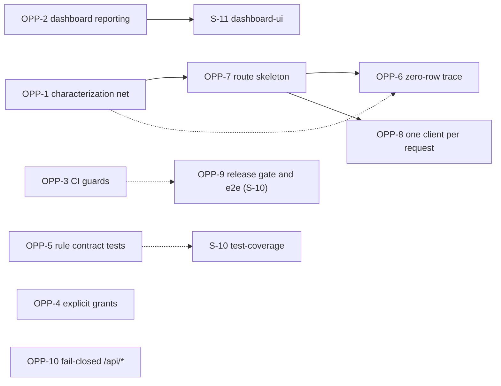

# Research: refactor-opportunities (which recorded problems to refactor, in what shape, in what order)

**Date**: 2026-10-06T13:17:28+02:00
**Researcher**: Claude (Sonnet 5.5) for Mariusz Złotucha
**Git Commit**: c9f64514e65e7dc8657ae5afeaf7dc302e45c32d (`master`, `origin/master` equal at research time)
**Branch**: refactor-opportunities/plan (created from `master` at the start of this run; uncommitted at research time: `CLAUDE.md` and `.claude/.10x-cli-manifest.json`, which are not part of this change, and this change folder)
**Repository**: streak-board

## Research Question

`context/archive/2026-10-05-data-access/research.md` records technical debt on the path "access to group and task data" and deliberately recommends nothing. This change asks the question it left open: **which** of the recorded problems are worth fixing, in **what target shape**, and in **what order**. The verbatim intent (Polish) is in `change.md`, `## Notes`.

Each recorded problem (D1-D22, plus the test gaps T1-T13 and the one adjacent observation) is examined from three read-only perspectives: (1) current shape at HEAD, (2) decision history (was it deliberate?), (3) migration feasibility (target options, reversible steps, safety net, blast radius). The document ends with ranked options and their trade-offs. **No refactor happens and no decision is taken here**; the decision belongs to `/10x-plan`.

## Summary

- **Evidence.** Of the 22 recorded items D1-D22, 14 map to a refactor opportunity (OPP-1 to OPP-10 below) and 8 are not opportunities: D2, D3, D6, D9, D16, D18, D20, D21 (reasons in "Items that are not opportunities"). The 4 test-gap IDs T6, T8, T12, T13 need no action (a second CI layer or unreachable, section 4), and the adjacent `prerender` observation is a 3-line chore.
- **Evidence (the picture moved since the data-access research).** HEAD `c9f6451` is 22 commits (merges included) after the commit that research was written at (`6814f69`; `git rev-list --count 6814f69..HEAD`). The 21 Supabase call sites are unchanged (18 `.from`, 3 `.rpc`, ast-grep and grep agree); the 6 silent empty-result branches are unchanged; `console.*` outside `src/lib/log.ts` fell from 10 to 5 sites (only `dashboard.astro:68,77,82,101,126` remain, `auth/callback.ts` now reports through `src/lib/log.ts`); `createClient` call sites grew from 19 to 21 (two Google auth files); tests that mock `@/lib/supabase` grew from 5 to 7 files. Two of the research's unknowns are now resolved locally: `src/types.ts` equals a fresh generation after Prettier (0-line diff), and the local table privileges match what migrations M5-M7 assume. Details: section 1.
- **Evidence (history).** Most of the debt was left in place on purpose, not by oversight: the silent zero-row branches (S-01 reviews, S-02 plan, S-08 plan `:43`), the dashboard `console.error` calls and the two-clients-per-request design (S-08 plan `:39,42,45` and audit G5/G11) are explicit "not doing" items; the release order "schema before code" and the backward-compatible-migration rule are S-05 decisions (`release-automation-and-auth-hardening/plan.md:36,40,256`). The gate that would enforce the rule is planned and not started (`test-plan.md:80,125`), and its owner on the roadmap is S-10 (`roadmap.md:148-160`, status `ready`).
- **Inference (ranking, section 7).** Execution order by value ÷ cost, with dependencies and roadmap collisions: OPP-2 dashboard failures through the log helper, OPP-1 characterization net for the 13 data routes, OPP-3 CI guards (merged-migration immutability, types freshness, destructive-migration marker), OPP-5 SQL-vs-TS rule contract tests, OPP-4 explicit table grants, OPP-7 route wrapper, OPP-6 zero-row denial trace, OPP-8 one client per request, OPP-10 fail-closed `/api/*` gate. OPP-9 (the full release-order gate and Playwright in CI) has the highest value in the abstract but is owned by S-10 and is listed as a track inside that slice, not as a step of this sequence.
- **Inference.** The structural opportunities (OPP-7, OPP-6, OPP-8) form one chain on the same 13 files and should start only after OPP-1 (the repo's own rule: characterization first, `CLAUDE.md` module 4 hard rules). OPP-2, OPP-3, OPP-4 and OPP-5 touch pairwise disjoint files (section 7) and are independent of that chain.
- **Unknown.** The hosted database state (grants, `max_rows`, applied migrations); whether the double-refresh failure of D19 occurs in production; whether the test suites, smoke and Playwright pass on this checkout (not run); all effort figures are estimates.

## Method and evidence legend

I worked alone and read-only for the repo: no sub-agents. The `/10x-research` skill delegates multi-area work by default, but the session's tool policy allows spawning agents only on an explicit user request, so the three perspectives were run by me in sequence with the same scope and the same anchor requirement.

- **[E] Evidence**: observed in a file or command output; carries `path:line` or the command. Counts are for HEAD `c9f6451` on the paths named in the same sentence or row.
- **[I] Inference**: my reading of the evidence.
- **[U] Unknown**: cannot be established from the repository alone.

What I read in full: `data-access/research.md` (all 567 lines), `lessons.md`, `roadmap.md`, `.github/workflows/ci.yml`, `src/lib/log.ts`, `src/lib/supabase.ts`, `src/middleware.ts`, `src/lib/{group-rules,task-rules,join-code,group-errors,task-errors}.ts`, `src/env.d.ts`, six of the 13 route handlers (`groups/{rename,remove-member,join}`, `tasks/{leave,checkoff,create}`), `dashboard.astro:36-130`, M6 header, the `-- accepted` markers of the migrations. Read in part: `test-plan.md` (§3-§5), `deployment-plan.md` (grep), the S-08 plan, the S-08 audit and its verify report (grep for G5, G11 and the recommendation list), S-01/S-02/S-03/S-04/S-05/S-07 plans and reviews (grep for the decision sentences quoted below).

Commands run (all read-only for the repo):

- `ast-grep run -l ts -p '$X.from($T)'` and `'$X.rpc($T, $$$)'` over `src` → 18 and 3 matches (same 21 as `grep -rnE '\.from\(|\.rpc\(' src`); `ast-grep run -l ts -p 'createClient($$$)' src` → 20 matches, plus 1 in `dashboard.astro:50` (grep, `.astro` is not parsed); `ast-grep run -l sql ...` → "sql is not supported", so every SQL statement below was read with grep or by eye.
- `git log`/`git show` for migration and CI history (section 3 cites SHAs and times).
- Two read-only checks against the local Supabase stack that was already running (I did not start it): `npx supabase gen types typescript --local` into the scratchpad, then a diff against `src/types.ts`; and `psql` `SELECT`s on `supabase_migrations.schema_migrations`, `pg_default_acl` and `information_schema.role_table_grants`. No test, smoke or build was run.

## 1. What changed since the data-access research (re-verification at HEAD)

| #   | Claim in `data-access/research.md`                          | Then                                         | HEAD `c9f6451` [E]                                                                                                                                                                                                                                                                                                                                                 | Verdict                                                             |
| --- | ----------------------------------------------------------- | -------------------------------------------- | ------------------------------------------------------------------------------------------------------------------------------------------------------------------------------------------------------------------------------------------------------------------------------------------------------------------------------------------------------------------ | ------------------------------------------------------------------- |
| R1  | 21 DB call sites in `src`, 18 `.from` + 3 `.rpc`            | 21                                           | 18 + 3, same files as before (`src/lib/{checkoffs,groups,tasks}.ts`, 11 route files)                                                                                                                                                                                                                                                                               | unchanged                                                           |
| R2  | `createClient` sites                                        | 19                                           | 21: middleware `:16`, `dashboard.astro:50`, 13 data routes (1 each), 6 auth files (`api/auth/{signin,signup,signout,google}.ts`, `auth/callback.ts:13`, `auth/google/callback.ts:20`)                                                                                                                                                                              | grew by 2 (S-07 Google files)                                       |
| R3  | 6 empty-result branches in routes, none reports             | 6                                            | `groups/rename.ts:40`, `groups/delete.ts:36`, `groups/leave.ts:29`, `groups/remove-member.ts:53`, `tasks/update.ts:44`, `tasks/delete.ts:39`; none calls a report helper; `lib/checkoffs.ts:96` reports an info line                                                                                                                                               | unchanged                                                           |
| R4  | `console.*` outside `log.ts`                                | 10 sites (5 dashboard + `callback.ts:25,30`) | 5 sites, all in `dashboard.astro:68,77,82,101,126`; `auth/callback.ts:28-37` uses `reportInfo`/`reportError`                                                                                                                                                                                                                                                       | D5 narrowed to the dashboard                                        |
| R5  | No test imports the mappers/normalisers                     | 0 files                                      | 0 files for `toGroupErrorCode`, `toTaskErrorCode`, `normalizeGroupName`, `normalizeJoinCode`, `normalizeUuid`, `checkoffResponse` (grep over `tests`, `scripts`); no test references `group-rules` or `MAX_GROUP_NAME_LENGTH`                                                                                                                                      | unchanged                                                           |
| R6  | Data handlers imported by a test                            | 2 of 13                                      | 2 of 13: `groups/join` (`groups-join-route.test.ts:4`), `tasks/create` (`tasks-create-route.test.ts:4`)                                                                                                                                                                                                                                                            | unchanged                                                           |
| R7  | Tests that mock `@/lib/supabase`                            | 5 files                                      | 7 files: `auth-callback`, `auth-google-callback`, `auth-google-start-route`, `auth-signin-route`, `groups-join-route`, `middleware`, `tasks-create-route`                                                                                                                                                                                                          | grew by 2 (coupling to the factory grows with every new route test) |
| R8  | Playwright not in CI                                        | 0 hits in `.github`                          | 0 hits (`grep -rni playwright .github`); `@playwright/test` is a devDependency (`package.json:47`); no e2e script in `package.json` scripts                                                                                                                                                                                                                        | unchanged                                                           |
| R9  | Release order: build, `db push --yes`, deploy               | `ci.yml:115-126`                             | `ci.yml:141-153` (build `:142`, `db push --yes` `:148`, deploy `:153`); new `changes` job and job-level `if:` for docs-only PRs (`:17-40`); post-deploy check now also probes the Google flow anonymously (`:182-209`); no table read in the check                                                                                                                 | order unchanged; CI grew                                            |
| R10 | `docker exec supabase_db_10x-astro-starter` in two places   | `package.json:15`, `ci.yml:81`               | `package.json` script `test:rls`, `ci.yml:108`; `config.toml:5` `project_id = "10x-astro-starter"`                                                                                                                                                                                                                                                                 | unchanged (anchor moved)                                            |
| R11 | `prerender = false` on route files                          | 15 of 18                                     | 17 of 20 route `.ts` files; missing: `api/auth/{signin,signout,signup}.ts`                                                                                                                                                                                                                                                                                         | same 3 files                                                        |
| R12 | Unknown: does `src/types.ts` equal a fresh generation?      | unknown                                      | equal after Prettier: raw generator output has 347 lines against 330 committed lines (formatting only); `prettier --stdin-filepath src/types.ts` over the raw output gives a 0-line diff. Local DB had all 7 migrations applied (`schema_migrations`)                                                                                                              | resolved for the local DB                                           |
| R13 | Unknown: local default privileges and grants                | unknown                                      | `pg_default_acl` (first 12 rows read) grants `arwdDxtm` on `public` tables to `anon`, `authenticated`, `service_role` for objects of role `supabase_admin`; `role_table_grants` shows `authenticated` has DELETE and SELECT on `groups`, `group_members`, `tasks`, `task_participants`, `task_checkoffs`, SELECT on the view, and `anon` has no row on any of them | local matches M5-M7's assumptions; hosted still unknown             |
| R14 | Unknown: was an applied migration edited after its release? | unknown                                      | one edit after release: M5's header comments in `9a3385e` (2026-10-01 02:54:48 +0200); see section 3, D13                                                                                                                                                                                                                                                          | partly resolved                                                     |
| R15 | `README.md:254` mentions `max_rows` not being pushed        | cited                                        | no hit for `max_rows` in `README.md` (grep); the constant and its comment are at `src/lib/tasks.ts:49-50`, `config.toml:18`                                                                                                                                                                                                                                        | the README anchor is gone; the risk (D1) stands                     |

## 2. Disposition of every recorded item

| ID                   | Recorded problem (short)                                | Disposition                                                  | Where                       |
| -------------------- | ------------------------------------------------------- | ------------------------------------------------------------ | --------------------------- |
| D1                   | grants and `max_rows` live outside migrations           | opportunity                                                  | OPP-4                       |
| D2                   | policies redefined across M1/M2, no consolidated schema | not an opportunity                                           | section 5                   |
| D3                   | unfiltered reads rely on RLS + `UNIQUE(user_id)`        | not an opportunity (blocked by a PRD non-goal)               | section 5                   |
| D4                   | 6 silent empty-result branches                          | opportunity                                                  | OPP-6 (via OPP-7)           |
| D5                   | dashboard reports with `console.error` only             | opportunity                                                  | OPP-2                       |
| D6                   | `rate_limited` branch has no data-access producer       | not an opportunity (live for auth)                           | section 5                   |
| D7, D8               | route DB-error branches, mappers, normalisers untested  | opportunity                                                  | OPP-1                       |
| D9                   | invite code is the only gate, no rate limit             | not an opportunity (accepted, with a revisit trigger)        | section 5                   |
| D10                  | weak anon assertions in Vitest                          | opportunity (6 (raport: 3) assertions in 3 tests, folded in) | OPP-1                       |
| D11                  | `src/types.ts` has no freshness check                   | opportunity                                                  | OPP-3                       |
| D12                  | release order without a compatibility gate              | opportunity: light guard now, full gate in S-10              | OPP-3 (light), OPP-9 (full) |
| D13                  | "applied migrations are immutable" only in a comment    | opportunity                                                  | OPP-3                       |
| D14                  | rules duplicated in SQL and TS                          | opportunity                                                  | OPP-5                       |
| D15, D17             | Playwright not in CI; duplicate e2e helper              | opportunity, owned by S-10                                   | OPP-9                       |
| D16                  | tests mock the Supabase factory                         | not an opportunity (cost driver of OPP-8)                    | section 5                   |
| D18                  | check-off period trusted from the client                | not an opportunity (accepted)                                | section 5                   |
| D19                  | two clients per request                                 | opportunity                                                  | OPP-8                       |
| D20                  | participation row can outlive a removed member          | not an opportunity (accepted)                                | section 5                   |
| D21                  | `docs/reference/contract-surfaces.md` missing           | not an opportunity (documentation)                           | section 5                   |
| D22                  | string contracts (prefix list, URLs, container name)    | opportunity (fail-closed gate) plus chores                   | OPP-10                      |
| T6, T8, T12, T13     | cheap test gaps (SQL-only or unreachable)               | no action                                                    | section 4                   |
| adjacent `prerender` | 3 auth routes lack `export const prerender = false`     | chore                                                        | section 5                   |

14 IDs map to an opportunity (D1, D4, D5, D7, D8, D10, D11, D12, D13, D14, D15, D17, D19, D22) and 8 do not (D2, D3, D6, D9, D16, D18, D20, D21).

## 3. Detailed findings per opportunity

Each entry: current shape [E], was it deliberate [E], target options, migration path, safety net, blast radius, trade-offs, effort [I]. Effort figures are one person working after hours and are estimates, not measurements. "Behaviour" says what a user or an HTTP client can observe; per the change rules a step that changes it is a separate change.

### OPP-1. Characterization net for the 13 data routes and their mappers (D7, D8; tightens D10; T1-T3)

**Current shape [E].**

- The 13 data routes (`src/pages/api/{groups,tasks}/*.ts`, 639 lines in total) all have one outline; 2 of 13 handlers are imported by a test (R6). No test imports the group/task error mappers, the group input normalisers or `checkoffResponse` (R5). `toTaskErrorCode` delegates to `toGroupErrorCode` (`task-errors.ts:14`), so one untested mapper sits behind the 11 routes that call a mapper.
- Existing patterns to copy: a mocked-route test with a hand-built `APIContext` (`tests/integration/groups-join-route.test.ts`, 92 lines; `tasks-create-route.test.ts`, 66 lines) and a small chainable fake Supabase client (`tests/unit/checkoffs-reporting.test.ts`, 127 lines).
- Weak anonymous assertions: `group-isolation.test.ts:193,197` accept `null` or `42501`; `:201-212` and `:225-236` assert only that `error` is not null; the strict `42501` check exists in `supabase/checks/rls-scenarios.sql` (data-access research §2.2, D10).
- The behavioural net that exists today: `scripts/smoke.mjs` (1805 lines) over HTTP, the DB suites and the SQL scenarios for the DB layer.

**Deliberate?** No decision to leave the routes untested was found. The S-08 plan wrote route tests for `groups/join` as part of its reporting scope (`observability-swallowed-errors/plan.md:251`); `test-plan.md` puts input validation in Phase 3, not started (`:81`). S-10's scope names "unit tests for logic without tests" (`roadmap.md:150,158`), so ownership overlaps (decision input 1).

**Target options.**

- A. One table-driven suite over all 13 routes with a fake chainable client: per route pin anonymous → redirect, invalid input → code, null client → `not_configured`, each mapped SQLSTATE → redirect code and report policy, empty result → today's response, thrown error → `unknown` plus the `*.exception` event; plus direct unit tests of the mappers and normalisers; plus the 6 (raport: 3) tightened anon assertions (in 3 tests).
- B. One test file per route, copying the join pattern: more readable, about 13 × 60-90 lines, more churn when OPP-7 lands.
- C. Extend smoke only (HTTP, real DB): slower, and the 1805-line script already pins markup that S-11 will change.
- D. Do nothing; rely on smoke and the DB suites.

**Migration path.** Tests only, each file independently revertible; no `src/` change. Write the fake against the supabase-js call chain (`.from().update().eq().select()`), not against the route's internals, so the same suite survives OPP-7.

**Blast radius.** `tests/` only. **Behaviour.** None.

**Trade-offs.** (+) Enables OPP-6, OPP-7, OPP-8 under the "safety net first" rule; closes T1, T2 and part of T3. (−) Mocks bypass RLS, which is acceptable here because the DB layer has two CI layers of its own; A couples to the call chain (a changed chain breaks it loudly, which is also its job); route-to-policy composition across groups (T3) still needs a real DB or smoke.

**Effort [I].** 1-2 evenings for A. **Collision.** S-10 (decision input 1).

### OPP-2. Dashboard load failures through the log helper (D5)

**Current shape [E].** `dashboard.astro:68,77,82,101,126` call `console.error` under `eslint-disable no-console` comments; the file does not import `@/lib/log`. These are the 5 `console.error|warn|log|info` call sites in `src` outside `log.ts` at HEAD (grep, R4); the lint rule that flags them is `no-console: "warn"` (`eslint.config.js:25`), hence the `eslint-disable` comments. The helper's parameter type is structural: `{ request, routePattern, locals }` (`log.ts:120-124`), and `AstroGlobal extends APIContext` (`node_modules/astro/dist/types/public/context.d.ts:14`, `routePattern` at `:583`), so `requestFields(Astro)` type-checks [I from the declarations; not compiled].

**Deliberate? Yes, deferred knowingly.** The S-08 plan lists "Dashboard answering 503 for failed reads and its per-read labels (audit G5) ... left for a later slice; S-11 can build on this contract" (`plan.md:39`) and "Migrating the 7 remaining `console.error` sites (`dashboard.astro` ×5, `callback.ts` ×2) to the helper" (`plan.md:45`); the audit rates G5 medium (`context/audits/observability/2026-10-02_check-off-and-uncheck-join-group.md:108`) and the verify run records it as "still open, out of S-08 scope" (`…verify….md:32`). The two `callback.ts` sites have since been migrated (S-07). The lesson on returned Supabase errors names "route handler, library or middleware" (`lessons.md:135`), not `.astro` pages (data-access Open Question 3).

**Target options.**

- A. Replace the 5 `console.error` calls with `reportError("dashboard.<read>.failed", reason, requestFields(Astro))`; HTTP response unchanged (still 200 with the banner).
- B. A, plus a status change (503 for an essential load failure, audit G5): a behaviour change, so a separate change that fits S-11.
- C. Leave until S-11.

**Migration path.** One phase, one file, revertible by one revert. No automated net can exist for it in Vitest (no test imports an `.astro` page, T9); verification is the S-08 method: stop the local Auth or DB container, load `/dashboard`, read the log lines (the S-08 plan rows 1.7-style checks).

**Blast radius.** `dashboard.astro` frontmatter. **Behaviour.** Telemetry only: new Sentry events and structured log lines on failures; HTTP unchanged.

**Trade-offs.** (+) Closes the dashboard part of MS-05's intent with a handful of lines; (−) adds Sentry events with request context on the failure path only (volume unknown); if S-11 restructures the frontmatter load section first, the change conflicts or is redone. **Effort [I].** Under an hour plus the manual check. **Collision.** S-11 (`roadmap.md:162-173`): do it before S-11.

### OPP-3. CI guards: merged-migration immutability, types freshness, destructive-migration marker (D13, D11, D12 light)

**Current shape [E].**

- D13: "applied migrations are immutable" is stated as a comment (M2 `:15`, data-access research); I found no check that enforces it: `ci.yml` (read in full) has none and the pre-commit hook runs `lint-staged` on `*.{ts,tsx,astro}` and `*.{json,css,md}` only (`.husky/pre-commit`, `package.json` `lint-staged`). `supabase db push` skips versions it already applied (`release-automation-and-auth-hardening/plan.md:256`), so a changed statement in an applied file would not be re-applied and the hosted schema would silently differ from the repo. History: exactly one edit after a release, M5's header comments (`9a3385e`, 2026-10-01 02:54:48 +0200; the diff has 6 insertions and 4 deletions, all comment lines; the release that applied M5 finished 2026-10-01 00:31 UTC = 02:31 +0200, `deployment-plan.md:166`). M4's two commits (`7e97a84` 23:49, `38d5eee` 23:54) precede its phase PR merge (`22697e6`, 23:58); M5's `e3c2d48` (01:33) and `db0f1ff` (01:38) precede PR #36's merge (`4768df4`, 01:41). M1-M3's last edits are dated 2026-09-25, before the first production push recorded the same day (`deployment-plan.md:122-125`; the time of the push is not recorded, [U]).
- D11: no script and no CI step regenerates `src/types.ts` (`package.json` scripts; `ci.yml` read in full). It equals a fresh generation today (R12). Generated types do not model grants (`types.ts:75-81` allows `owner_id` in `groups.Update`; the grant allows `name`, M2:99).
- D12 light: build runs before `db push --yes` (`ci.yml:141-148`); the compatibility rule is prose (`lessons.md:81`, S-05 plan `:256`). Grep over the 7 migrations: `drop policy`/`alter policy` appear in 1 of 7 files (M2), `revoke` in 7 of 7 (the revoke-all-then-grant pattern), so a plain `revoke` match is useless; only a check that knows which table pre-exists would be selective, and ast-grep has no SQL grammar.

**Deliberate?** D12: yes. S-05 chose "schema before code", rejected automated down-migrations and wrote the compatibility rule down (`plan.md:36,40,256`); the enforcing check is test-plan Phase 2, "not started" (`test-plan.md:80,125`). D13: edits before merge are the workflow (review runs before push, `lessons.md:105-110`); no decision about post-merge edits. D11: the command lives in `CLAUDE.md` prose; no decision to leave it ungated was found.

**Target options.**

- A. Immutability guard in the `changes` job: fail a PR when `git diff --name-status origin/$BASE_REF...HEAD -- supabase/migrations` shows `M`, `D` or `R` (an added file is `A`; a 9a3385e-style comment fix would need an explicit override such as a PR label). No false positive for the pre-merge edits listed above, because those files were new relative to the base [I].
- B. Types gate in the `integration` job after `supabase start` (`ci.yml:103-104`): `supabase gen types typescript --local | npx prettier --stdin-filepath src/types.ts | diff -u src/types.ts -`. The Prettier step is required: the raw output differs in formatting (R12).
- C. Marker rule: a migration with `drop policy`, `alter policy`, `drop function|table|column` or a `revoke` on a table created in an earlier file must carry a header line `-- compat: <why the deployed code still works>`. Heuristic: it prompts the author, it proves nothing; M2 and M6 are the existing files it would have flagged [I from reading the 7 files; not run].
- D. Nothing now; S-10 builds the real gate (OPP-9).

**Migration path.** Three independent CI steps, each revertible by deleting its step. A and B are exact; C is advisory.

**Blast radius.** `.github/workflows/ci.yml` (and one `package.json` script if B is wrapped). **Behaviour.** None for users; PRs that edit a merged migration or leave types stale fail.

**Trade-offs.** (+) Each is cheap and closes a silent hosted-versus-repo divergence; B adds roughly one `gen types` run to a job whose stack is already up. (−) C overlaps test-plan Phase 2's "migration/code consistency check" (`test-plan.md:125`) and would be redone or dropped when S-10 lands. **Effort [I].** A 1 h, B 1 h, C 2-3 h. **Collision.** S-10 for C.

### OPP-4. Explicit table grants in a migration (D1)

**Current shape [E].** `SELECT` and `DELETE` for `authenticated` on `groups`, `group_members` and `tasks` come from no migration; M6's header lists them as "kept untouched" (`20261001120000_harden_table_privileges.sql:16-17`) and M5/M7 describe the platform defaults as an assumption (`M5:39-41`, `M7:41-42`, data-access research). Locally the assumption holds (R13). `max_rows = 1000` is in `supabase/config.toml:18`, mirrored by `POSTGREST_MAX_ROWS` (`src/lib/tasks.ts:49-50`) and guarded at `tasks.ts:64` and `checkoffs.ts:17`; `db push` does not push `config.toml`.

**Deliberate?** The reliance on defaults is stated, not argued. M5 and M7 already use revoke-all-then-explicit-grant for their own tables, and M6 brought the older tables in line only for revokes. No decision to keep the defaults was found.

**Target options.**

- A. One migration `grant select, delete on public.groups, public.group_members, public.tasks to authenticated;`, a no-op where the privilege exists, plus a scenario in `supabase/checks/rls-scenarios.sql` that pins the full privilege table through `information_schema.role_table_grants` in both directions.
- B. A, and replace the hard-coded row cap by a count-based truncation check (`count: "exact"`). [U] not verified against the installed supabase-js.
- C. First an owner observation: the owner runs the same `role_table_grants` query on the hosted project (credentialed, so the owner runs it, never through the chat), then decide.
- D. Nothing.

**Migration path.** A is one additive migration plus one SQL scenario; a grant is undone by a later migration, but the schema does not roll back with the code (`lessons.md:81`), so the migration must be backward compatible (it is: it grants what the deployed code already uses). C needs no code.

**Blast radius.** One migration file, `rls-scenarios.sql`, and the migrations list in `CLAUDE.md`/README if they enumerate files. **Behaviour.** None expected where hosted matches [I].

**Trade-offs.** (+) The privileges that the whole app depends on become part of the repo, which matters when a new environment is built from migrations alone (staging is parked, `roadmap.md:200`). (−) In production it is probably a no-op, since the flows passed after each migration release (`deployment-plan.md:158-180`) [I]; it does not remove the `max_rows` mirror. **Effort [I].** 1-2 h plus the owner query.

### OPP-5. Contract tests for the rules duplicated in SQL and TS (D14)

**Current shape [E].** Duplicated rules and their TS side: group name 1-80 with the `' \t\r\n'` trim set (`group-rules.ts:4-24`, SQL M2:88-89), task title 1-80 (`task-rules.ts:5,22-28`, M4:25), recurrence list (`task-rules.ts:8`, M4:26), join-code format (`group-rules.ts:6,26-36`, M1:17 and M2:92-93). Mechanical checks at HEAD: the recurrence list is checked by regex-parsing `*_create_tasks.sql` (`tests/unit/task-rules.test.ts:53-56`), so a later `ALTER` of that CHECK in a new file would not be seen [I]; title 80/81 is pinned by two independent tests (`task-rules.test.ts:23-31`, `task-permissions.test.ts:189-201`); no test references `group-rules` (R5).

**Deliberate?** The shared module is deliberate: it "trims the same characters as the DB CHECK" (`group-rules.ts:9`) and carries a "must match the CHECK" note (`task-rules.ts:7`). No decision about mechanical checking was found in the sources read.

**Target options.**

- A. Behaviour-based contract tests in the existing integration layer: for each boundary case (0, 1, 80, 81 code points; whitespace-only; NBSP, which is not in the trim set; each `TASK_RECURRENCES` value and one value outside the list; a generated `join_code` against `normalizeJoinCode`) assert "TS accepts ⇔ the real DB accepts", using `createGroupAs` and `createTaskAs` (`tests/helpers/supabase.ts:50,79`). This replaces the file-regex check.
- B. Generate the TS constants from SQL: needs a parser or generator for 4 constants; cost exceeds value.
- C. Drop the TS pre-validation and rely on SQLSTATE mapping: loses the early friendly error and changes the UX.

**Migration path.** Tests only. One accepted group case needs one fresh user because `UNIQUE(group_members.user_id)` allows one group per user (M1:24); rejected cases reuse one user.

**Blast radius.** `tests/` only. **Behaviour.** None. **Trade-offs.** (+) Turns drift from "UX drift nobody sees" into a red CI check; closes T1 for `normalizeGroupName` and the join-code half of D14. (−) A few more test users per run on a stack that the Vitest global setup sweeps (`lessons.md:122`). **Effort [I].** 2-3 h. **Collision.** S-10 (unit tests and Stryker on rule modules, `roadmap.md:158`).

### OPP-6. Zero-row denials leave a trace (D4)

**Current shape [E].** Six routes have an empty-result branch with no report call (R3): four answer `?error=forbidden` unconditionally, `groups/leave.ts:29` and `groups/remove-member.ts:53` branch on the caller. `tasks/leave.ts:28-40` never reads the row count. The only reporting empty-result branch is the check-off undo (`lib/checkoffs.ts:96`, info).

**Deliberate? Yes, three times, for stale submits.** S-01 phase 3 review F3 made a repeated leave silent (`group-create-join-manage/reviews/impl-review-phase-3.md:59-60`), phase 4 did the same for remove-member (`…phase-4.md:72-74`); S-02's plan states "Stale requests follow the remove-member precedent" (`task-create-and-manage/plan.md:52`); the S-08 plan keeps "zero-row `forbidden` in update/delete/rename" quiet "as decided in earlier reviews" (`plan.md:43`). Those decisions concern stale and idempotent submits. The four unconditional branches answer `forbidden`, an authorisation denial, which the sources I read do not discuss separately [I].

**Target options.**

- A. An info event on the four unconditional branches and on the non-owner arm of the two conditional ones (for example `groups.rename.denied`), response unchanged.
- B. Fold A into OPP-7's wrapper as a `denied` outcome.
- C. A structural lint: an ast-grep rule that an empty-result branch in a route must call a `report*` helper. ast-grep is not a repo dependency (no entry in `package.json`, no `sgconfig.yml`), so this adds a tool.
- D. Keep quiet; revisit if policy divergence is ever observed.

**Migration path.** A is six one-line edits plus six tests (or none extra if OPP-1's net exists); each route is its own revertible commit.

**Blast radius.** The six route files. **Behaviour.** Telemetry only. **Trade-offs.** (+) A policy that wrongly hides rows from owners would at least log. (−) Reopens a deliberate decision; info lines add noise for forged or stale submits (volume unknown); its detection value is bounded, because a policy regression in the repo's schema already fails the DB tests in CI, so the residual case is hosted divergence (D1, D12). **Effort [I].** 1-2 h. **Sequence.** After OPP-1; cheaper inside OPP-7.

### OPP-7. A route skeleton for the 13 data routes (Branch by Abstraction, one route per commit) (enabler for D4, D8, D19)

**Current shape [E].** Every one of the 13 data routes has exactly one `createClient`, one `locals.user` check and one `try/catch` (per-file grep at HEAD). The skeleton lines are 13 of 50 in `groups/rename.ts` (`:11-14`, `:22-25`, `:45-49`) and 13 of 45 in `tasks/leave.ts` (`:10-14`, `:22-25`, `:41-44`), about a quarter of a route [I from two files]. What varies: form key and validator; the pre-read (present in 9 (raport: 10) of 13: `groups/create`, `groups/join`, `tasks/leave` have none, and `groups/leave` reads only after the mutation, `leave.ts:32`); the mutation chain; the mapper (group or task); the empty-result policy (R3); the response (11 routes use a redirect plus `reportMapped`, `checkoff` and `uncheck` use `checkoffResponse`, `src/lib/checkoff-response.ts:10-16,26-35`; `groups/join` also clears a cookie, `join.ts:19,38,43`).

**Deliberate?** Partly. Plans copy the preamble on purpose ("same preamble as `delete.ts`", `task-join-and-leave/plan.md:150`; "same preamble as `join.ts`", `checkoff-and-leaderboard/plan.md:239`), and the one factored-out piece, `checkoff-response.ts`, was extracted so "the two routes do not duplicate it" (`checkoff…/plan.md:242`). A search of the archived plans and reviews for preamble, wrapper, boilerplate and duplication terms found no decision against a shared skeleton. The lesson "every returned Supabase `{ error }` is reported" (`lessons.md:133-138`) is a convention enforced by review today.

**Target options.**

- A. A small wrapper that owns the user check, client creation with the `not_configured` redirect, the `try/catch` with the `*.exception` event, and error mapping with `reportMapped`; each route supplies parse and run. Adopt it route by route (Branch by Abstraction), simplest first (`tasks/leave`, `groups/create`), and keep both styles until the last route moves.
- B. Smaller: extract two helpers only (`requireUser`, `withSupabase`), less indirection and less enforcement.
- C. Nothing; keep 13 flat, readable files.

**Migration path.** Add the wrapper with its own unit tests; migrate one route per commit, each revertible; after the last route, optionally add a rule to the existing dependency-cruiser config (`.dependency-cruiser.cjs`, currently `no-circular`, `lib-not-upstream`, `components-not-pages`) forbidding direct `@/lib/supabase` imports from routes. Not before: the rule would fail on the unmigrated routes.

**Safety net.** OPP-1 first (13 of the 13 routes pinned); smoke as the second layer.

**Blast radius.** 13 route files, `src/lib/` (one new module), the 2 mocked-route tests, `CLAUDE.md` conventions. **Behaviour.** None intended; the risk is a changed redirect code, which OPP-1 exists to catch.

**Trade-offs.** (+) One place for client creation (turns OPP-8 into a one-line change), for denial traces (OPP-6) and for the exception policy; the reporting lesson becomes structural. (−) Indirection in files that read top to bottom today; the wrapper API has to express `checkoff`/`uncheck`'s JSON path and `join`'s cookie handling; the largest cost on the list. **Effort [I].** 1-2 days after OPP-1.

### OPP-8. One Supabase client per request, shared through `locals` (D19)

**Current shape [E].** 21 `createClient` call sites (R2). The middleware client resolves the user and discards itself; each handler and the dashboard builds a second client from the original `Cookie` header (`middleware.ts:16`, for example `groups/rename.ts:22`, `dashboard.astro:50`). `App.Locals` carries only `user` (`src/env.d.ts:1-5`). Seven test files mock the factory (R7).

**Deliberate? Deferred knowingly.** The S-08 plan lists "Sharing one Supabase client per request (G11)" under "What We're NOT Doing" (`plan.md:42`); the audit rates G11 medium, says each request builds two clients and, with an expired access token, both refresh (probe P13d), and recommends "one client per request in the middleware, shared through `locals`" (`…check-off-and-uncheck-join-group.md:114`, recommendation 5 at `:156`). The audit marks the production trigger unconfirmed: it depends on the hosted refresh-token reuse window (local `config.toml:167` is 10 seconds; hosted [U]). Emulated probes P13a-P13f exist in `context/audits/observability/probes/2026-10-02_check-off-and-uncheck-join-group/suite.mjs:191-196`.

**Target options.**

- A. Middleware sets `context.locals.supabase`; all 20 other sites read it.
- B. Same, for the 14 data-path sites only (13 routes and the dashboard), leaving the 6 auth files.
- C. No structural change: log 42501 together with the auth state (the audit's second suggestion).
- D. Nothing until production shows the symptom.

**Migration path.** After OPP-7 it is a one-place change inside the wrapper plus the dashboard; before it, 14 to 20 edits. Verify with the P13 probe harness against a built preview (it is not wired into CI [E]; whether it runs on this checkout is [U]).

**Blast radius.** `middleware.ts`, `env.d.ts`, 14-20 call sites, 7 test files (they switch from mocking the factory to injecting `locals.supabase`). **Behaviour.** Intended HTTP-neutral, but it changes when refresh happens and where cookies are written, so treat it as behaviour-affecting.

**Trade-offs.** (+) Removes one token refresh per request on the expired-token path and the anon-downgrade failure mode. (−) The trigger is unconfirmed, the test churn is the largest of the list, and the coupling grows with every new route test (R7). **Effort [I].** 0.5-1 day after OPP-7, 1.5-2 days before it.

### OPP-9 (S-10 track). The full release-order gate and Playwright in CI (D12, D15, D17)

**Current shape [E].** `release` needs `[ci, smoke, integration]` (`ci.yml:113`) and runs: link `:130`, migration list `:136`, build `:141-145`, `db push --yes` `:147-151`, deploy `:152-156`, live check `:157-209`. The live check requests `/` (200), `/dashboard` (302), `/auth/callback` (302) and two Google hops, anonymously; it reads no table. `smoke` and `integration` run the new code against a fresh stack that has all migrations (`ci.yml:57-110`); no job runs the previous release's code against the new schema. Playwright is not in CI (R8); `tests/e2e/local-supabase.ts:86,99` repeats `createGroupAs`/`createTaskAs` from `tests/helpers/supabase.ts:50,79`.

**Deliberate?** The gate is planned and deferred: Phase 2 "Release ordering gate", status "not started" (`test-plan.md:80`), gate "required after §3 Phase 2" (`:125`). S-10 is `ready` and its Risk names Phase 2 and Phase 3 (`roadmap.md:159`). The e2e position is unresolved on paper: `test-plan.md:102` still says "e2e: none — not planned" while S-10's scope includes e2e (`roadmap.md:157`, listed as an Unknown at `:157`).

**Target options.**

- A. An "old code against new schema" job: run the previously released commit's smoke against a stack with the new migrations; needs the previous release SHA (no version marker exists; S-08 left it out, `plan.md:42`), obtainable from the last successful `release` run in GitHub [I].
- B. An authenticated canary between `db push` and deploy: needs a production test user, an owner decision.
- C. The OPP-3 marker plus human review (status quo plus).
- D. For e2e: a CI job with build, preview, stack and browsers; S-10 decides scope.

**Trade-offs.** (+) A closes exactly the interval D12 describes (schema ahead of code until the deploy step). (−) Plumbing and extra CI time (conditional on a `supabase/migrations` change through the existing `changes` job [I]); B needs credentials in CI. This is the highest value item in the abstract (D12 heads the data-access ranking), yet none of the three remaining M-2 slices states a schema outcome (`roadmap.md:132-173`), so the exposure is not scheduled to arrive soon [I]. **Owner.** S-10; opening a parallel change would duplicate it.

### OPP-10. A fail-closed gate for `/api/*` (D22)

**Current shape [E].** `PROTECTED_ROUTES = ["/dashboard", "/api/groups", "/api/tasks"]` (`middleware.ts:8`), matched by exact path or prefix at `:29`. All 13 data handlers re-check `locals.user` (13 of 13 files contain one `locals.user` reference, grep at HEAD). Smoke asserts anonymous redirects for group create and the task actions (`scripts/smoke.mjs:547,569,630`). `/api/auth/*` is public. The 19 `action="/api/..."` strings in `.astro` and `.tsx` files (grep) are literals; the container name is the third string contract (R10).

**Deliberate?** The allow-list of protected prefixes is the original design; a new route family needs its prefix added (data-access research §1.7). No decision against a fail-closed form was found.

**Target options.**

- A. Protect every `/api/*` path except `/api/auth/*`, plus `/dashboard`; a new route family is protected on creation.
- B. A constants module for the action URLs: 19 strings, little type safety gained.
- C. Derive the container name instead of repeating it (hygiene).

**Migration path.** A is one function in `middleware.ts` plus boundary tests (`/dashboardx`, `/api/groupsx`, `/api/auth/*` stays public; T10). **Behaviour.** An anonymous request to an unknown `/api/*` path would change from the app's 404 to a 302 to sign-in [I]: by the change rules a separate behaviour change.

**Trade-offs.** (+) Removes a step a future author must remember. (−) Current exposure is low because each handler re-checks the user; the benefit is future-proofing. **Effort [I].** 1-2 h plus tests.

## 4. Test gaps that need no action

T6 (`UPDATE` on `group_members` asserted only in SQL), T8 (check-off window time-zone independence asserted only in SQL, `rls-scenarios.sql:895-902`), T12 (other-group actor variants unused) and T13 (WITH CHECK clauses unreachable behind column grants) each have a second CI layer or cannot be reached from a client (data-access research §2.2); I did not re-examine them and they carry no refactor.

## 5. Items that are not opportunities

| ID                   | Why not                                                                                                                                                                                                                                                                                                                  | Revisit trigger                                                                          |
| -------------------- | ------------------------------------------------------------------------------------------------------------------------------------------------------------------------------------------------------------------------------------------------------------------------------------------------------------------------ | ---------------------------------------------------------------------------------------- |
| D2                   | The final policy state is exercised by CI and replayed in the data-access research §1.4; a snapshot file would need its own freshness gate (the OPP-3 B mechanism) for a documentation gain. Low value, low cost.                                                                                                        | A reviewer repeatedly misreads M1's stale policies                                       |
| D3                   | Blocked by a PRD non-goal: "Wiele grup na jednego użytkownika" (`prd.md:111`, parked at `roadmap.md:192`). `getMyGroup` has 6 callers (`groups/{delete,leave,remove-member,rename}.ts`, `tasks/create.ts`, `dashboard.astro`); it is a latent blast radius, not a defect.                                                | The PRD drops that non-goal                                                              |
| D6                   | The `rate_limited` branch of `reportMapped` (`log.ts:112`) is live: `auth-errors.ts:30,68,105` return it and 14 call sites reach `reportMapped` (11 data routes, `api/auth/signin.ts:23`, `api/auth/signup.ts:25`, `auth/google/callback.ts:48`). Removing it for the data path would require splitting a shared helper. | None                                                                                     |
| D9                   | Accepted in SQL comments (`20260925011727_harden_group_rls.sql:55`, `20260925161234_add_group_member_list_and_preview.sql:34`): the code entropy is the only gate.                                                                                                                                                       | More real users arriving through S-09 and a public landing page (`roadmap.md:23-27`) [I] |
| D16                  | Churn, not risk: a changed call chain breaks 7 mocked tests loudly. Relevant as the cost driver of OPP-8 (R7).                                                                                                                                                                                                           | The number of mocked files keeps growing                                                 |
| D18                  | Accepted and documented as trust-based (`20261002090000_create_task_checkoffs.sql:10-13`; PRD non-goal on anti-cheat, `roadmap.md:194`).                                                                                                                                                                                 | None                                                                                     |
| D20                  | Accepted race documented in `20261001090000_create_task_participants.sql:15-19` ("Known, accepted race").                                                                                                                                                                                                                | None                                                                                     |
| D21                  | Documentation only: `docs/` does not exist and `git ls-files \| grep -c contract-surfaces` gives 0; the file is promised by the workspace-level instruction file, not by this repo's `CLAUDE.md`.                                                                                                                        | The team wants a name registry                                                           |
| adjacent `prerender` | `api/auth/{signin,signout,signup}.ts` lack `export const prerender = false` while `CLAUDE.md` says API routes must export it (17 of 20 route `.ts` files do). [I] Harmless under `output: "server"`; fix by adding the line or relaxing the rule, 3 lines, not ranked.                                                   | An adapter or Astro upgrade changes the default                                          |

## 6. Code References

- `src/pages/api/groups/rename.ts:11-14,22-25,40,45-49` - the route skeleton and one silent zero-row branch
- `src/pages/api/groups/remove-member.ts:53-56`, `src/pages/api/groups/leave.ts:29`, `src/pages/api/groups/delete.ts:36`, `src/pages/api/tasks/{update.ts:44,delete.ts:39}` - the other silent empty-result branches
- `src/pages/api/tasks/leave.ts:28-40` - row count never read
- `src/pages/api/groups/join.ts:19,28-43` - cookie handling that a wrapper must express
- `src/pages/api/tasks/checkoff.ts:11-46`, `src/lib/checkoff-response.ts:44-69` - the JSON/redirect variant
- `src/lib/log.ts:109-117,120-130` - `reportMapped` policy and the structural `requestFields` type
- `src/lib/{group-errors,task-errors}.ts` - SQLSTATE mapping, untested
- `src/lib/{group-rules,task-rules}.ts` - rules duplicated from the CHECK constraints
- `src/pages/dashboard.astro:50,55-60,68,77,82,101,126` - second client, concurrent reads, `console.error` sites
- `src/middleware.ts:8,16,29` - protected prefixes, middleware client
- `src/env.d.ts:1-5` - `App.Locals`
- `.github/workflows/ci.yml:17-40,103-110,141-209` - docs-only skip, integration job, release order and live check
- `supabase/migrations/20261001120000_harden_table_privileges.sql:1-26` - least-privilege revokes and what stays
- `context/audits/observability/2026-10-02_check-off-and-uncheck-join-group.md:108,114,153-159` - G5, G11, the recommendation list
- `context/archive/2026-10-02-observability-swallowed-errors/plan.md:39,42,43,45` - the deliberate "not doing" items
- `context/foundation/test-plan.md:80,102,125` - release-gate phase and e2e position
- `context/foundation/roadmap.md:148-173,192` - S-10, S-11, parked multi-group

## 7. Architecture Insights

- **Most remaining debt is a deliberate deferral that has come due, not an oversight.** The S-08 plan names the dashboard sites, the shared client and the quiet zero-row branches as "not doing"; the release gate is a planned test-plan phase. The refactor question is therefore mostly "reopen this decision now?", and the answer depends on what the roadmap does next.
- **The 13 data routes are flat on purpose and uniform by copy.** The uniformity (13 of 13 share one outline) is what makes both a wrapper (OPP-7) and a characterization suite (OPP-1) cheap, and it is also why the "every returned `{ error }` is reported" lesson rests on review at HEAD: the only mechanical check I found is `no-console: "warn"` (`eslint.config.js:25`), which keeps bare `console` calls out but does not require an error branch to call a report helper (`eslint.config.js` was read only at its rule lines).
- **The seams that matter are between components that are correct alone**: release order (CI vs DB), config outside migrations (grants, `max_rows`), two clients per request, duplicated rules. The cheap fixes are guards at those seams (OPP-3, OPP-4, OPP-5); the structural fixes (OPP-7, OPP-8) are expensive and pay off only if routes keep multiplying.
- **Dependency order (Mikado view).**

- **Independence check for parallel work (`lessons.md:119-124`).** OPP-2 edits `dashboard.astro`; OPP-3 edits `ci.yml`; OPP-4 adds a migration and edits `rls-scenarios.sql`; OPP-5 edits `tests/` only: pairwise disjoint files [I]. OPP-1, OPP-7, OPP-6 and OPP-8 all touch `src/pages/api/**` and the same test folders, so they are sequential. OPP-4 and OPP-5 both need the local stack; only one session runs DB-backed tests at a time.

## 8. Historical Context (from prior changes)

Scored per sentence; "supported" means I read the quoted source.

- `context/archive/2026-10-02-observability-swallowed-errors/plan.md:39,42,43,45` - the dashboard 503/labels, the shared client, the quiet zero-row branches and the 7 `console.error` sites are explicit non-goals. Supported (re-read). The sentence "as decided in earlier reviews" at `:43` is supported by S-01 phase 3/4 reviews for leave and remove-member and by the S-02 plan `:52`; I did not find a review that decided update/delete/rename specifically: partial.
- `context/audits/observability/2026-10-02_check-off-and-uncheck-join-group.md:108,114,153-159` - G5 and G11, and the recommended order of fixes. Supported (re-read); G11's production trigger "unconfirmed" is quoted from the audit, not tested by me.
- `context/archive/2026-09-30-release-automation-and-auth-hardening/plan.md:31,36,40,114,256` - Supabase Branching rejected, automated down-migrations out of scope, schema-before-code order, the release step list, the compatibility rule. Supported (re-read).
- `context/changes/deployment/deployment-plan.md:122-125,156-180` - first production push of M1-M3 on 2026-09-25 and each later migration applied by the `release` job. Supported by the lines read; the time of the 2026-09-25 push is not recorded.
- `context/archive/2026-09-25-group-create-join-manage/reviews/impl-review-phase-3.md:59-60`, `…phase-4.md:72-74` - quiet redirects for stale leave and remove-member. Supported (read).
- `context/foundation/test-plan.md:80,102,125`, `context/foundation/roadmap.md:148-160` - Phase 2 not started, e2e "not planned", S-10 `ready` with both in scope. Supported (re-read); the contradiction at `test-plan.md:102` versus `roadmap.md:157` is the roadmap's own Unknown.
- `context/foundation/lessons.md:81,102-109,133-138` - the compatibility rule, review-before-push, and the returned-error reporting rule. Supported (re-read).
- Not read: the archived plans' interview transcripts and the reviews of S-03/S-04/S-05/S-07 beyond the grepped sentences; I did not verify who decided the early copy-the-preamble style beyond the plan sentences quoted in OPP-7.

## 9. Related Research

- `context/archive/2026-10-05-data-access/research.md` - the input; all IDs (D1-D22, T1-T13, V1-V28) refer to it.
- `context/audits/observability/2026-10-02_check-off-and-uncheck-join-group.md` and its verify report - G5, G11 and the probe harness.
- `context/archive/2026-10-02-observability-swallowed-errors/research.md` - earlier research on swallowed errors (not read in full here).
- `context/map/repo-map.md` - risk zone #2 that framed the data-access research (not re-read).

## 10. Open Questions

1. **Ownership of overlapping items.** Do OPP-1, OPP-5 and the e2e half of OPP-9 live inside S-10 (`test-coverage`) or in this change? They cannot be done twice. (decision input, section 11)
2. **Hosted state.** Do the hosted grants and `max_rows` match the local ones (OPP-4 C)? The query needs credentials that only the owner holds.
3. **D19 in production.** Does the second refresh fail on the hosted project, and what is its refresh-token reuse window? No static reading can settle it.
4. **Scope of the reporting lesson.** Is `lessons.md:133-138` meant to cover `.astro` pages and zero-row results? OPP-2 and OPP-6 assume yes for the dashboard and "undecided" for zero-row denials.
5. **Appetite for behaviour changes.** OPP-8 and OPP-10 change observable behaviour (refresh timing, 404 to 302 on unknown API paths) and would be separate changes.
6. **Upcoming schema work.** Is any migration that narrows a policy or revokes a privilege planned? If yes, OPP-3 and OPP-9 move up.
7. **Do the suites currently pass?** Vitest, the SQL scenarios, smoke and Playwright were not run in this research.
8. **`db push` with an older local timestamp** (relevant to parallel worktrees, data-access Unknown): still untested.

## 11. Ranking of refactor opportunities (research output; the decision is for `/10x-plan`)

**Criteria.** Value = how much real operational or user-facing risk it removes, using the data-access research's real/cheap split corrected by section 1 (H/M/L). Cost = files, tests and CI touched (S/M/L). Safety = what pins today's behaviour before the first change (strong/partial/none). Each phase must be independently revertible; structural steps follow Branch by Abstraction or Strangler Fig, and anything that changes observable behaviour is a separate change. The order below is by value ÷ cost, then adjusted for dependencies and roadmap collisions.

| Rank | Opportunity                                          | Problems              | Value                    | Cost                          | Safety today                  | Behaviour                      | Collision / dependency                              | Why here                                                                                                                      |
| ---- | ---------------------------------------------------- | --------------------- | ------------------------ | ----------------------------- | ----------------------------- | ------------------------------ | --------------------------------------------------- | ----------------------------------------------------------------------------------------------------------------------------- |
| 1    | OPP-2 dashboard load failures through the log helper | D5                    | M-H                      | S                             | none (`.astro`)               | telemetry only                 | before S-11 rewrites the dashboard                  | A deliberately deferred MS-05 gap, 5 call sites in 1 file, response-neutral                                                   |
| 2    | OPP-1 characterization net for the 13 data routes    | D7, D8, D10           | M                        | M                             | partial                       | none (tests only)              | S-10 overlap; prerequisite of ranks 6-8             | Zero product risk and the enabler for every structural step                                                                   |
| 3    | OPP-3 CI guards (A immutability, B types, C marker)  | D13, D11, D12 (light) | M                        | S                             | n/a                           | none for users                 | C overlaps S-10 Phase 2                             | Each guard closes a silent hosted-versus-repo divergence for about an hour of CI work                                         |
| 4    | OPP-5 SQL-versus-TS rule contract tests              | D14                   | M-L                      | S                             | partial                       | none                           | S-10 overlap                                        | Turns invisible UX drift into a red check; real DB, no new tooling                                                            |
| 5    | OPP-4 explicit table grants                          | D1                    | M                        | S                             | strong (SQL scenarios)        | none where hosted matches [I]  | needs an owner observation to know the hosted state | Makes the app's grants reproducible from migrations; probably a no-op in production                                           |
| 6    | OPP-7 route skeleton (wrapper, one route per commit) | D4, D8, D19 (enabler) | M                        | L                             | partial → strong after rank 2 | none intended                  | after OPP-1                                         | Makes the reporting lesson structural and turns ranks 7-8 into one-place changes; the largest cost                            |
| 7    | OPP-6 zero-row denials leave an info trace           | D4                    | L-M                      | S (alone) / ~0 (inside OPP-7) | partial → strong after rank 2 | telemetry only                 | reopens a deliberate decision; after OPP-1          | Value is bounded: repo-schema regressions already fail DB tests                                                               |
| 8    | OPP-8 one Supabase client per request                | D19                   | M? (trigger unconfirmed) | M-L                           | none for expired tokens       | behaviour-affecting            | after OPP-7; 7 test files change                    | The audit's own medium finding, but the production trigger is unknown; verify with the P13 probes first                       |
| 9    | OPP-10 fail-closed `/api/*` gate                     | D22                   | L                        | S                             | partial (smoke)               | changes HTTP for unknown paths | separate change; boundary tests first               | Future-proofing only: the 13 data handlers already re-check the user                                                          |
| S-10 | OPP-9 full release-order gate and Playwright in CI   | D12, D15, D17         | H                        | L                             | n/a                           | none for users                 | owned by S-10 (`roadmap.md:148-160`)                | Highest value in the abstract (D12 headed the data-access ranking) but already scheduled and no schema work is on the roadmap |

**Sensitivity: what would change the order.**

- A planned migration that narrows a policy or revokes a privilege moves OPP-3 and OPP-9 to the top.
- An owner observation that hosted grants differ from local moves OPP-4 to rank 1.
- A production 42501 or `forbidden` blip right after token refresh moves OPP-8 up and makes OPP-7 its prerequisite.
- If S-11 starts before OPP-2, fold OPP-2 into S-11 instead of running it separately.
- If S-10 is planned first, OPP-1 and OPP-5 become phases of S-10 and leave this change.

**Trade-off in one line per option, for the decision.** OPP-2: cheapest closure of a known gap vs a possible conflict with S-11. OPP-1: safest enabler vs duplicate work with S-10. OPP-3: three cheap guards vs C's overlap with the planned gate. OPP-4: reproducibility vs a probable no-op. OPP-5: catches drift vs a few more test users. OPP-6: visibility of denials vs reopening a deliberate quiet decision. OPP-7: one place for the skeleton vs indirection in files that read flat today. OPP-8: removes a double refresh vs an unconfirmed trigger and the largest test churn. OPP-10: fail-closed default vs a separate behaviour change for little current exposure. OPP-9: closes the top recorded risk vs being S-10's job.

**Process notes for the planner.** `lessons.md:19-24` says planning skills run on a planning branch; `/10x-new` did not create one, so I created `refactor-opportunities/plan` from `master` before researching. Nothing was committed. `lessons.md:112-117` assigns max effort to `/10x-research`; this session ran at the harness-selected level, which I cannot confirm is max, so the synthesis may deserve a re-run at max effort. The skill's default of delegating multi-area research to sub-agents was not used (see Method).

## Weryfikacja twierdzeń (ast-grep)

Run at HEAD `c9f6451` on 2026-10-06 (the commit the research was written at; nothing was committed in between), after the research and before planning. The structural claims that the ranking stands on were listed; each got an ast-grep pattern or rule (`ast-grep 0.45.3`, `-l ts` or `-l tsx`; `.astro` files are not parsed and were read with grep; SQL has no grammar and was read with grep). Every zero from ast-grep was repeated with classic grep. Verdicts: potwierdzone, doprecyzowane, obalone (none was obalone). Three numbers were corrected in place as "new (raport: old)": the D10 assertion count (rows D10 in section 2 and OPP-1 option A) and the pre-read count in OPP-7. Section 11 (the ranking) and the "Deliberate?" verdicts are unchanged. Results that bear on a candidate are described only here and marked "do decyzji na etapie planowania".

Baseline taken in the same run (not a claim of the report, closes Open Question 7 except smoke and Playwright): `npm run lint` exit 0; `npx astro check` 0 errors, 0 warnings, 4 hints; `npm test` 27 files and 385 tests passed in 6.4 s; `npm run test:rls` "ALL RLS SCENARIOS PASSED (293 assertions)".

| #   | Twierdzenie                                                                                                                                                                                                             | Werdykt                                                                   | Dowód (plik:linia)                                                                                                                                                                                                                                                                                                                                                                                                                                                                                                                                                                        | Metoda (wzorzec/reguła)                                                                                                                                                                                                                                                                                       |
| --- | ----------------------------------------------------------------------------------------------------------------------------------------------------------------------------------------------------------------------- | ------------------------------------------------------------------------- | ----------------------------------------------------------------------------------------------------------------------------------------------------------------------------------------------------------------------------------------------------------------------------------------------------------------------------------------------------------------------------------------------------------------------------------------------------------------------------------------------------------------------------------------------------------------------------------------- | ------------------------------------------------------------------------------------------------------------------------------------------------------------------------------------------------------------------------------------------------------------------------------------------------------------- |
| V1  | 21 Supabase call sites in `src`: 18 `.from(...)` and 3 `.rpc(...)` (R1, Summary)                                                                                                                                        | potwierdzone                                                              | `.from`: `lib/checkoffs.ts:15,64,86`, `lib/groups.ts:21`, `lib/tasks.ts:15,30,58,72`, `api/groups/{create:29,delete:30,leave:23,remove-member:41,rename:34}.ts`, `api/tasks/{create:38,delete:33,join:34,leave:28,update:38}.ts`. `.rpc`: `lib/groups.ts:28,36`, `api/groups/join.ts:28`                                                                                                                                                                                                                                                                                                  | `ast-grep run -l ts -p '$X.from($T)' src` (18) and `-p '$X.rpc($$$)' src` (3); grep `\.from\(\|\.rpc\(` over `src` gives 21 lines (6 of them are `.from(` on a continuation line of a multi-line chain)                                                                                                       |
| V2  | 13 data routes, 639 lines in total (OPP-1)                                                                                                                                                                              | potwierdzone                                                              | `src/pages/api/groups/*.ts` (6 files) and `src/pages/api/tasks/*.ts` (7 files)                                                                                                                                                                                                                                                                                                                                                                                                                                                                                                            | `ls … \| wc -l` = 13; `cat … \| wc -l` = 639                                                                                                                                                                                                                                                                  |
| V3  | Each of the 13 data routes has exactly one `createClient`, one `locals.user` reference and a handler body that is a single `try/catch` (OPP-7, OPP-10)                                                                  | potwierdzone                                                              | `createClient` ×1 and `locals.user` ×1 in each of the 13 files; handler shape in 13 files (for example `groups/rename.ts:10`); sign-in guard `if (!context.locals.user) { return context.redirect("/auth/signin"); }` in 5 files (`groups/{delete,join,rename}`, `tasks/{delete,update}`) and `if (!user) { … }` in 8 = 13; the catch calls `reportError("<route>.exception", error, requestFields(context))` in 13 files (`groups/create.ts:40` … `tasks/update.ts:50`)                                                                                                                  | `createClient($$$)` and `$C.locals.user` counted per file; `export const POST: APIRoute = async ($C) => { try { $$$A } catch ($E) { $$$B } }`; `if (!$C.locals.user) { return $C.redirect("/auth/signin"); }` and the `!user` shape; `reportError($EVT, $E, requestFields($C))`                               |
| V4  | 21 `createClient` call sites: middleware, dashboard, 13 data routes, 6 auth files (R2, OPP-8)                                                                                                                           | potwierdzone                                                              | 20 files with one `createClient(...)` each: `middleware.ts:16`, the 13 routes, `api/auth/{google,signin,signout,signup}.ts`, `auth/callback.ts`, `auth/google/callback.ts`; plus `dashboard.astro:50` (grep)                                                                                                                                                                                                                                                                                                                                                                              | `ast-grep run -l ts -p 'createClient($$$)' src` (20 files); grep over `*.astro` (1)                                                                                                                                                                                                                           |
| V5  | 6 empty-result branches in the data routes, none reports; the only reporting one is `lib/checkoffs.ts:96` (R3, OPP-6)                                                                                                   | potwierdzone                                                              | the 6 are `if (data.length === 0)` at `groups/delete.ts:36`, `groups/leave.ts:29`, `groups/remove-member.ts:53`, `groups/rename.ts:40`, `tasks/delete.ts:39`, `tasks/update.ts:44`; none contains a `report*` call; `lib/checkoffs.ts:96` does (`reportInfo("uncheck.nothing_removed", …)`)                                                                                                                                                                                                                                                                                               | `ast-grep run -l ts -p '$X.length === 0'` (6 in the routes, 1 in `lib`); two inline rules (`kind: if_statement`, condition `$D.length === 0`, a `report*` call under `stopBy: end` required or forbidden): without a report returns the 6, with one returns `checkoffs.ts:96`                                 |
| V6  | `tasks/leave.ts:28-40` never reads the row count (OPP-6)                                                                                                                                                                | potwierdzone                                                              | `tasks/leave.ts:28-33` destructures only `{ error, status }` from `.delete()….select("task_id")`                                                                                                                                                                                                                                                                                                                                                                                                                                                                                          | `$X.length === 0` has no match in the file; zero confirmed by reading it and by `grep -n length src/pages/api/tasks/leave.ts` (0 lines)                                                                                                                                                                       |
| V7  | `console.*` outside `src/lib/log.ts`: 5 sites, all in `dashboard.astro` (R4, OPP-2)                                                                                                                                     | potwierdzone                                                              | `.ts`: only `lib/log.ts:63,91,99`; `.tsx`: none; `.astro`: `dashboard.astro:68,77,82,101,126`                                                                                                                                                                                                                                                                                                                                                                                                                                                                                             | `ast-grep run -l ts -p 'console.$M($$$)' src` (3, all in `log.ts`) and `-l tsx` (0); the zero confirmed by `grep -rnE 'console\.(error\|warn\|log\|info\|debug)' src --include='*.ts' --include='*.tsx'` (only `log.ts`); `.astro` by grep                                                                    |
| V8  | 14 `reportMapped` call sites: 11 data routes plus `auth/signin.ts:23`, `auth/signup.ts:25`, `auth/google/callback.ts:48` (D6)                                                                                           | potwierdzone                                                              | `groups/{create:32,delete:33,join:31,leave:26,remove-member:50,rename:37}.ts`, `tasks/{create:43,delete:36,join:41,leave:36,update:41}.ts` and the three auth sites                                                                                                                                                                                                                                                                                                                                                                                                                       | `ast-grep run -l ts -p 'reportMapped($$$)' src` (14)                                                                                                                                                                                                                                                          |
| V9  | 11 of the 13 data routes call an error mapper (6 `toGroupErrorCode`, 5 `toTaskErrorCode`); `toTaskErrorCode` delegates to `toGroupErrorCode`; `checkoff` and `uncheck` answer through `checkoffResponse` (OPP-1, OPP-7) | potwierdzone                                                              | `toGroupErrorCode` in `groups/{create:31,delete:32,join:30,leave:25,remove-member:49,rename:36}.ts` and `task-errors.ts:14`; `toTaskErrorCode` in `tasks/{create:42,delete:35,join:40,leave:35,update:40}.ts`; `checkoffResponse` 5 call sites in each of `tasks/checkoff.ts` and `tasks/uncheck.ts`                                                                                                                                                                                                                                                                                      | `toGroupErrorCode($$$)`, `toTaskErrorCode($$$)`, `checkoffResponse($$$)` over `src`                                                                                                                                                                                                                           |
| V10 | `getMyGroup` has 6 callers (D3)                                                                                                                                                                                         | potwierdzone                                                              | `groups/{delete:21,leave:32,remove-member:31,rename:28}.ts`, `tasks/create.ts:33`, `dashboard.astro:52`                                                                                                                                                                                                                                                                                                                                                                                                                                                                                   | `getMyGroup($$$)` over `src` (5) and grep over `dashboard.astro` (1)                                                                                                                                                                                                                                          |
| V11 | The pre-read is present in 10 of 13 routes; `groups/create`, `groups/join`, `tasks/leave` have none (OPP-7)                                                                                                             | doprecyzowane: 9 (raport: 10)                                             | a read before the mutation exists in 9 routes: `getMyGroup` in `groups/{delete:21,remove-member:31,rename:28}.ts` and `tasks/create.ts:33`, `getTask` in `tasks/{checkoff:31,delete:28,uncheck:32,update:33}.ts`, `taskExists` in `tasks/join.ts:30`. `groups/leave.ts:32` calls `getMyGroup` only after an empty delete, so 4 routes read nothing before the mutation: `groups/{create,join,leave}.ts` and `tasks/leave.ts`. The count shapes the wrapper's pre-read slot; it does not move the ranking                                                                                  | `getMyGroup($$$)`, `getTask($$$)`, `taskExists($$$)` over `src`, then reading `groups/leave.ts`                                                                                                                                                                                                               |
| V12 | 2 of the 13 data handlers are imported by a test (R6, OPP-1)                                                                                                                                                            | potwierdzone                                                              | `groups-join-route.test.ts:4` and `tasks-create-route.test.ts:4`; three other tests import auth handlers (`auth-signin-route.test.ts:5`, `auth-google-start-route.test.ts:5`, `auth-google-roundtrip.test.ts:3`)                                                                                                                                                                                                                                                                                                                                                                          | `ast-grep run -l ts -p 'import { $$$ } from $S' tests`, filtered to specifiers containing `pages/api`; grep `pages/api/` in `tests` agrees                                                                                                                                                                    |
| V13 | No test imports the group/task error mappers, `group-rules`, `join-code` or `checkoff-response` (R5, OPP-1, OPP-5)                                                                                                      | potwierdzone                                                              | 0 files for `group-errors`, `task-errors`, `group-rules`, `join-code`, `checkoff-response`; the one grep hit for `checkoff-response` (`tests/unit/checkoff-client.test.ts:5`) is a comment, not an import                                                                                                                                                                                                                                                                                                                                                                                 | the import pattern over `tests` and `scripts` returns 0 per module; each zero repeated with `grep -rln <module> tests scripts`                                                                                                                                                                                |
| V14 | 7 test files mock `@/lib/supabase` (R7, D16, OPP-8)                                                                                                                                                                     | potwierdzone                                                              | the `auth-callback`, `auth-google-callback`, `auth-google-start-route`, `auth-signin-route`, `groups-join-route`, `middleware` and `tasks-create-route` tests (line 7 or 8 of each)                                                                                                                                                                                                                                                                                                                                                                                                       | `ast-grep run -l ts -p 'vi.mock("@/lib/supabase", $$$)' tests` (7); `grep -rln` returns the same 7                                                                                                                                                                                                            |
| V15 | 17 of 20 route `.ts` files export `prerender = false`; `api/auth/{signin,signout,signup}.ts` do not (R11)                                                                                                               | potwierdzone                                                              | 17 matches under `src/pages` (for example `groups/rename.ts:8`); 20 `.ts` files under `src/pages`; the 3 files without the line                                                                                                                                                                                                                                                                                                                                                                                                                                                           | `ast-grep run -l ts -p 'export const prerender = false' src/pages`; `find src/pages -name '*.ts'`                                                                                                                                                                                                             |
| V16 | `createGroupAs` and `createTaskAs` exist twice (D17, OPP-9)                                                                                                                                                             | potwierdzone (the first pattern was wrong)                                | `tests/helpers/supabase.ts:50,79` and `tests/e2e/local-supabase.ts:86,99`                                                                                                                                                                                                                                                                                                                                                                                                                                                                                                                 | the first pattern `async function createGroupAs($$$) { $$$ }` returned 0 although grep found 4 declarations (the declarations carry a return-type annotation the pattern lacks); the rule `kind: function_declaration` with `has: { field: name, regex: ^create(Group\|Task)As$ }` returns the same 4 as grep |
| V17 | 19 `action="/api/..."` literals in `.astro` and `.tsx` files (D22, OPP-10)                                                                                                                                              | potwierdzone                                                              | 10 in `.astro` (`dashboard.astro` ×8, `Topbar.astro`, `GoogleButton.astro`) and 9 in `.tsx` (`SignInForm:50`, `SignUpForm:77`, `CreateGroupForm:35`, `JoinGroupForm:34`, `RenameGroupForm:39`, `CheckoffControl:109,125`, `CreateTaskForm:36`, `EditTaskForm:84`)                                                                                                                                                                                                                                                                                                                         | a `jsx_attribute` rule on `action` with an `/api/` string (9 in `.tsx`; a first `<form action="$A">` pattern returned 0 and was replaced); `.astro` and the total by grep (10 and 19)                                                                                                                         |
| V18 | Weak anonymous assertions in `group-isolation.test.ts` (D10, OPP-1)                                                                                                                                                     | doprecyzowane: 6 assertions in 3 tests (raport: 3)                        | `:193,197` `toSatisfy(code === null \|\| code === RLS_VIOLATION)` (test at `:187`); `:203` (test at `:201`) and `:227,231,235` (test at `:214`) `expect(…error).not.toBeNull()`                                                                                                                                                                                                                                                                                                                                                                                                           | `expect($E).toSatisfy($F)` (2) and `expect($E).not.toBeNull()` (4) over the file                                                                                                                                                                                                                              |
| V19 | The recurrence list is checked by a regex over the `*_create_tasks.sql` file (D14, OPP-5)                                                                                                                               | potwierdzone                                                              | `tests/unit/task-rules.test.ts:53-60` (`readdirSync`, `endsWith("_create_tasks.sql")`, the regex on `tasks_recurrence_allowed`); the CHECK is `supabase/migrations/20260930120000_create_tasks.sql:26`                                                                                                                                                                                                                                                                                                                                                                                    | read (the claim is about one test body, no structural pattern applies)                                                                                                                                                                                                                                        |
| V20 | The rules duplicated between SQL and TS: name 1-80, title 1-80, recurrence list, join-code defaults (D14, OPP-5)                                                                                                        | potwierdzone                                                              | `20260925011727_harden_group_rls.sql:89` (name) and `:93` (join_code default of 12 characters, superseding `20260925003350_create_groups_and_group_members.sql:17`, 8 characters); `20260930120000_create_tasks.sql:25,26`                                                                                                                                                                                                                                                                                                                                                                | grep `char_length\|check (\|join_code` over the first three migrations (no SQL grammar for ast-grep)                                                                                                                                                                                                          |
| V21 | `App.Locals` carries only `user` (OPP-8)                                                                                                                                                                                | potwierdzone                                                              | `src/env.d.ts:1-5`                                                                                                                                                                                                                                                                                                                                                                                                                                                                                                                                                                        | read                                                                                                                                                                                                                                                                                                          |
| V22 | `PROTECTED_ROUTES = ["/dashboard", "/api/groups", "/api/tasks"]` at `middleware.ts:8`, matched at `:29` (OPP-10)                                                                                                        | potwierdzone                                                              | `src/middleware.ts:8,29`                                                                                                                                                                                                                                                                                                                                                                                                                                                                                                                                                                  | read                                                                                                                                                                                                                                                                                                          |
| V23 | The row cap lives in `config.toml:18`, `POSTGREST_MAX_ROWS` (`lib/tasks.ts:50`) and two guards (D1, OPP-4)                                                                                                              | potwierdzone                                                              | `supabase/config.toml:18`, `src/lib/tasks.ts:50,64`, `src/lib/checkoffs.ts:17`                                                                                                                                                                                                                                                                                                                                                                                                                                                                                                            | grep `POSTGREST_MAX_ROWS` over `src` and `max_rows` in `config.toml`                                                                                                                                                                                                                                          |
| V24 | Release order: build `:142`, `db push --yes` `:148`, deploy `:153`; `release` needs `[ci, smoke, integration]` (R9, OPP-9)                                                                                              | potwierdzone                                                              | `.github/workflows/ci.yml:113,142,148,153`                                                                                                                                                                                                                                                                                                                                                                                                                                                                                                                                                | read                                                                                                                                                                                                                                                                                                          |
| V25 | OPP-1 is "tests only" and each test file can be run on its own                                                                                                                                                          | doprecyzowane (do decyzji na etapie planowania)                           | `vitest.config.ts:14` registers a `globalSetup` that reads the local stack status and fails when it is unreachable (`tests/setup/global-setup.ts:103-110`): every `npm test` run, including pure unit files, needs `supabase start`. A new route suite would run in the required `integration` job (`ci.yml:105-106`)                                                                                                                                                                                                                                                                     | read of `vitest.config.ts` and `tests/setup/global-setup.ts`                                                                                                                                                                                                                                                  |
| V26 | OPP-7 migration path: "optionally add a rule to the existing dependency-cruiser config forbidding direct `@/lib/supabase` imports from routes" would enforce the wrapper                                                | doprecyzowane (do decyzji na etapie planowania)                           | `npm run deps` exists only as a script (`package.json:17`) and is referenced nowhere in `.github/`, `.husky/`, `README.md` or `CLAUDE.md`, so a dependency-cruiser rule would run neither in CI nor in the pre-commit hook; dependency-cruiser does not parse `.astro` (`.dependency-cruiser.cjs:2`); `npm run lint` does run in CI (`ci.yml:50`) and in lint-staged (`.husky/pre-commit`: `npx lint-staged`; `package.json` `lint-staged`), so an ESLint `no-restricted-imports` override for the route paths is the enforceable form                                                    | grep `depcruise\|npm run deps` over `.github .husky package.json README.md CLAUDE.md` (1 hit, the definition); read of `.dependency-cruiser.cjs`, `ci.yml`, `.husky/pre-commit`                                                                                                                               |
| V27 | OPP-3 A: an immutability guard "in the `changes` job" fails PRs that edit merged migrations                                                                                                                             | doprecyzowane, placement not sufficient (do decyzji na etapie planowania) | a failing `changes` job does not block a merge: the `master` ruleset requires the single check `integration` and has no bypass actors (`gh api repos/mariuszzlotucha/streak-board/rulesets/24254172`: `required_status_checks: [{context: "integration"}]`, `bypass_actors: []`), and `integration` still runs when `changes` fails (`ci.yml:91`: `!cancelled()` and an empty output is not `'false'`). A guard that blocks has to fail the `integration` job (a step in it; `ci.yml:94` checks out one commit, so the base ref must be fetched) or be made a required check by the owner | read of `ci.yml:17-40,89-110`; read-only `gh api` call for the ruleset                                                                                                                                                                                                                                        |
| V28 | OPP-3 B: `supabase gen types typescript --local \| npx prettier --stdin-filepath src/types.ts \| diff -u src/types.ts -` is an exact freshness check (R12)                                                              | potwierdzone; one CI unknown (do decyzji na etapie planowania)            | re-run at HEAD: 0 diff lines; local CLI v2.117.0 equals the CI pin (`ci.yml:69,101,128`). The CI `integration` job starts the stack with `postgres-meta` excluded (`ci.yml:104`); the debug trace of `gen types --local` shows a one-off `node` process connecting to the database (`Connecting to db 5432`), so it does not use the long-running service, but the image pull in CI is [I], not observed                                                                                                                                                                                  | the pipeline run locally with the scratchpad copy; `npx supabase gen types typescript --local --debug`                                                                                                                                                                                                        |

Candidates that the verification bears on, for the decision: OPP-3 (A needs a different placement; B needs its CI run as the test), OPP-7 (the enforcement option in the migration path is not enforced as written, and the wrapper's pre-read slot is optional for 4 routes), OPP-1 (the suite runs only with the local stack up). None of the results removes a candidate or changes the ranking order.
