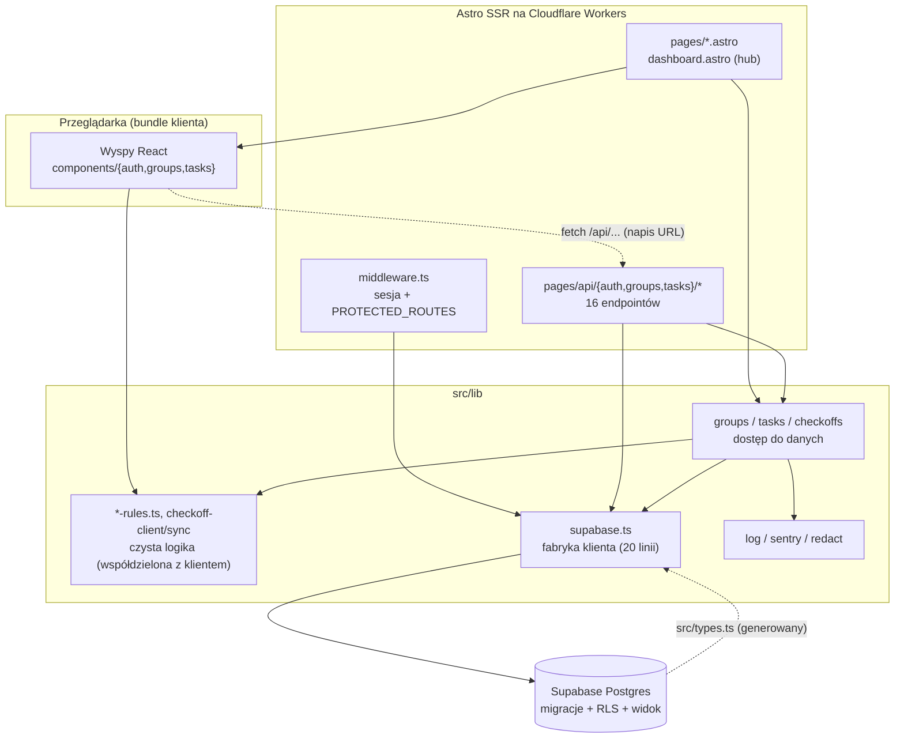

# Mapa projektu: StreakBoard

Stan na 2026-10-05, HEAD `d03c673`. Synteza trzech raportów roboczych: [`artifact-1-territory.md`](artifact-1-territory.md) (gdzie żyje aktywność), [`artifact-2-structure.md`](artifact-2-structure.md) (jak to jest powiązane), [`artifact-3-contributors.md`](artifact-3-contributors.md) (kogo zapytać). Liczby i dowody są w tych raportach, tu są tylko wnioski.

## 1. TL;DR

StreakBoard to aplikacja do wspólnego śledzenia nawyków. Grupy zakładają zadania, członkowie odhaczają je okresowo, a ranking liczy serie (streaki). Technicznie to Astro SSR z wyspami React, Supabase (Auth, Postgres z RLS) i wdrożeniem na Cloudflare Workers. Repo ma ~3 tygodnie historii i jednego autora. Praca idzie slice'ami (grupy → zadania → check-off → obserwowalność), a w tej samej historii leżą kod i dokumenty procesu w `context/`. Aktywność skupia się w `src/lib` (reguły i dostęp do danych), w migracjach SQL i w jednym widoku, `dashboard.astro`. Najbardziej „boli" tam, gdzie reguły dostępu żyją w SQL, którego żadne narzędzie nie widzi, oraz w sesji (middleware).

Linia kropkowana oznacza powiązanie, którego graf importów nie widzi.

## 2. Teren

**Gdzie struktura katalogów nie odpowiada aktywności.** Większość commitów dotyczy `context/` (plany, review, roadmapa, lessons, 114 przeniesień do archiwum), a nie kodu. Najczęściej zmieniane pliki to dokumenty (`roadmap.md` 28, `lessons.md` 24, `CLAUDE.md` 23, `README.md` 20). Wśród plików kodu na czele jest `scripts/smoke.mjs` (19), potem `dashboard.astro` (12). Katalog `src/pages/` wygląda na „cienki routing", ale zawiera logikę wiążącą dane w `dashboard.astro` (455 linii, 22 zależności).

**Moduły głębokie.** Mały interfejs, dużo logiki, zero zależności zewnętrznych: `src/lib/streak-rules.ts` (150 linii), `leaderboard-rules.ts` (139), `task-rules.ts`, `group-rules.ts`. Reguły używa zarówno klient, jak i serwer.

**Moduły płytkie, ale szeroko używane.** `src/lib/supabase.ts` (24 importujących) to 20-liniowa fabryka klienta. Endpointy API mają po ~40 linii i delegują do `lib/`.

**Aktywność w czasie** (tygodnie od 2026-09-14: 11, 47, 133 commitów, 1 dzień czwartego). Slice'y kolejno zamykają obszary: UI i auth rosły w tygodniu 2, testy i migracje zadań w tygodniu 3. Tempo odzwierciedla w dużej mierze proces (jeden commit na fazę planu i osobny na poprawki z review), więc nie jest miarą wysiłku.

**Granice, które realnie istnieją:**

- klient ↔ serwer: kod z `components/` sięga tylko do 8 czystych modułów `lib` (graf importów, bez wyjątków). Nic serwerowego (`supabase`, `log`, `sentry`) nie trafia do bundla klienta,
- `lib` nie importuje `components` ani `pages`; cykli importów nie ma (graf importów).

## 3. Realne powiązania

Dla każdego powiązania podaję źródło wiedzy.

| Powiązanie                                                                                                                                            | Skąd to wiem                                                                                                        | Rodzaj                                                                                            |
| ----------------------------------------------------------------------------------------------------------------------------------------------------- | ------------------------------------------------------------------------------------------------------------------- | ------------------------------------------------------------------------------------------------- |
| Wyspy React ↔ reguły w `lib` (`task-rules`, `group-rules`, `streak-rules`, `leaderboard-rules`, `auth-rules`)                                         | graf importów                                                                                                       | ręczna edycja. Zmiana reguły rusza bundle klienta i serwer naraz                                  |
| Slice zwykle dotyka `src/lib` + widoki + komponenty + `scripts/smoke.mjs` (np. 11 commitów dla trójki `scripts` + `components` + `pages`)             | historia gita                                                                                                       | ręczna edycja, ale wymuszona workflow: lekcja wymaga, by każdy krok smoke asercją sprawdzał wynik |
| Komponenty i `dashboard.astro` wołają endpointy po napisie (`/api/groups/create`, `/api/tasks/checkoff` itd.)                                         | `grep` po `fetch(`, `action=` w `src/`                                                                              | **brak grafu**: kontrakt jest tylko napisem, TypeScript go nie sprawdza                           |
| `PROTECTED_ROUTES = ["/dashboard", "/api/groups", "/api/tasks"]` w `middleware.ts` ↔ nazwy tras                                                       | odczyt pliku                                                                                                        | **brak grafu**: ochrona to prefiksy napisów                                                       |
| Migracje SQL ↔ `lib/groups                                                                                                                            | tasks                                                                                                               | checkoffs.ts`(tabele, widok`task_checkoff_periods`, triggery)                                     | nie objęte żadnym narzędziem | **unknown**: SQL nie ma grafu, a nie „brak powiązań". Weryfikują to dopiero testy integracyjne i `rls-scenarios.sql` |
| Migracja → `src/types.ts`                                                                                                                             | historia gita: 6 z 10 commitów dotykających migracji zmienia też `types.ts`; CLAUDE.md opisuje plik jako generowany | **regeneracja** (`supabase gen types`), tańsza niż ręczna edycja                                  |
| 5 testów integracyjnych mockuje `@/lib/supabase` (`createClient`), jeden mockuje `astro:middleware`, jeden `@/lib/sentry`, jeden `@sentry/cloudflare` | `grep vi.mock` w `tests/`                                                                                           | **mock**: zmiana sygnatury `createClient` psuje testy przez mock, nie przez import                |
| `astro:env/server`, `astro:middleware`, `cloudflare:workers`                                                                                          | dependency-cruiser: 4 nierozwiązane importy                                                                         | **brak grafu** dla warstwy runtime Workers                                                        |

Ograniczenie grafu dla `.astro`: dependency-cruiser nie parsuje tych plików, więc krawędzie z 11 plików `.astro` pochodzą z mojego regexu na frontmatterze. Importy dynamiczne mogły zostać pominięte.

**Warstwy i cykle:** kierunek `pages/api` → `components` → `lib` jest jednostronny, cykli 0 (graf importów, algorytm SCC).

## 4. Strefy ryzyka

Każda ma co najmniej dwa niezależne sygnały. Brak revertów i hotfixów w historii, więc „poprawki" to głównie zaplanowane poprawki po review.

1. **Logowanie i sesja.** Gdzie: `src/middleware.ts`, `src/pages/api/auth/*`, `src/pages/auth/callback.ts`, `src/lib/auth-state.ts`. _Dlaczego:_ middleware jest jedyną bramą dla `/dashboard`, `/api/groups` i `/api/tasks` (blast radius, graf importów), a ochrona opiera się na prefiksach napisów (brak grafu). Plik pojawia się w commitach 7 razy, a obszar auth przeszedł przez trzy slice'y utwardzające (historia gita: `signup-error-codes`, `release-automation-and-auth-hardening`, `observability-swallowed-errors`). `callback.ts` nie jest opisany w `CLAUDE.md`.
2. **Dostęp do danych grup i zadań (uprawnienia na poziomie bazy).** Gdzie: `supabase/migrations/*` (m.in. `harden_group_rls`, `harden_table_privileges`), `supabase/checks/rls-scenarios.sql` (1238 linii). _Dlaczego:_ 4 z 11 commitów to poprawki po review, w tym dwie migracje wprost „hardening" (historia gita). Logika uprawnień nie ma grafu zależności, więc nikt nie widzi, które moduły zależą od których polityk (unknown).
3. **Check-off i ranking serii.** Gdzie: `src/lib/{streak-rules,leaderboard-rules,checkoffs,checkoff-sync}.ts`, `src/components/tasks/CheckoffControl.tsx`. _Dlaczego:_ reguła zależy od strefy czasowej (`vitest.config.ts` wymusza `TZ=America/Los_Angeles`), a ten sam kod działa po obu stronach: w bundlu klienta i na serwerze (graf importów). Plan slice'a wprost odnotowuje ryzyko CPU na `/dashboard` w trybie darmowym Workers (`context/archive/2026-10-01-checkoff-and-leaderboard/plan.md`). Obszar powstał w dwa dni, więc brak historii napraw nie oznacza braku błędów.
4. **Widok grupy i zadań (dashboard).** Gdzie: `src/pages/dashboard.astro`. _Dlaczego:_ 22 zależności i 455 linii (graf importów), 12 commitów, w tym 4 poprawki po review (historia gita). Plik nie jest importowalny w Vitest, więc pokrywają go tylko e2e i smoke.

## 4a. Wygląda groźnie, ale nie jest

- **`scripts/smoke.mjs`** (19 commitów, 1655 linii, w 16 innych obszarach naraz): workflow wymaga rozszerzenia smoke przy każdym slice'u (`context/foundation/lessons.md`). To jedna przyczyna wszystkich tych sprzężeń. Uwaga: ta sama lekcja zapisuje, że kroki smoke wcześniej nie sprawdzały wyniku, więc to raczej dług jakości niż strefa zmiany.
- **`README.md`, `CLAUDE.md`, `package.json`, `context/foundation/{roadmap,lessons}.md`, `deployment-plan.md`:** wspólne dokumenty edytowane przy każdym slice'u (lekcja o worktree opisuje je jako „docs every slice edits"). Wysoka liczba commitów to skutek workflow.
- **`src/lib/supabase.ts`** (fan-in 24): 20 linii, jedna funkcja. Wysoki fan-in nie oznacza dużej logiki, a testy i tak ją mockują. Ryzyko leży w middleware, nie tu.
- **`src/pages/api/auth/*`** (zmieniane z 15 innymi obszarami): to artefakt commita `init` (1494 linii), a nie realne sprzężenie.
- **`src/types.ts`:** wygenerowany z bazy. Zmienia się razem z migracjami przez regenerację.
- **`.claude/.10x-cli-manifest.json`** (12 commitów): wygląda na plik aktualizowany przez CLI kursu, nie praca nad produktem.
- **`context/changes` ↔ `context/archive`:** 114 przeniesień liczy te same pliki dwa razy. Usunięcia 106 plików to archiwizacja.
- **Poprawki po review:** 19 z 21 commitów `fix` to „apply phase N review findings", czyli zaplanowana pętla review, a nie awarie.
- **`dist/`, `.astro/`, `playwright-report/`, `test-results/`:** gitignorowane, wykluczone z analizy.
- **`log.ts`** (fan-in 19): ma wysoki fan-in, bo to moduł logowania, a nie dlatego, że wiele rzeczy od niego zależy w sensie logiki (130 linii, ma test jednostkowy).

## 5. Kogo zapytać

W całej historii jest **jeden człowiek: Mariusz Złotucha** (192 z 192 commitów nie-merge, 100% linii w `git blame`). Nie ma drugiego kandydata, więc zamiast niego podaję dokumentację decyzji w `context/archive/`. 175 commitów ma współautora Claude, więc z gita nie rozróżnię, które decyzje były czyje.

| Strefa              | Kogo zapytać     | Gdzie szukać uzasadnienia                                                                                                                           |
| ------------------- | ---------------- | --------------------------------------------------------------------------------------------------------------------------------------------------- |
| Logowanie i sesja   | Mariusz Złotucha | `context/archive/2026-09-30-release-automation-and-auth-hardening/`, `2026-09-25-signup-error-codes/`, `2026-10-02-observability-swallowed-errors/` |
| Dostęp do danych    | Mariusz Złotucha | `context/archive/2026-09-25-group-rls-hardening/`, `2026-09-25-group-schema-and-rls/`, `2026-10-01-task-join-and-leave/`                            |
| Check-off i ranking | Mariusz Złotucha | `context/archive/2026-10-01-checkoff-and-leaderboard/` (plan i review faz)                                                                          |
| Dashboard           | Mariusz Złotucha | `context/archive/2026-09-25-group-create-join-manage/` i slice'y zadań                                                                              |

Nie czytałem treści tych dokumentów, tylko ich nazwy i jeden fragment planu check-offów.

## 6. Pierwszy dzień

Kolejność od szerokiego obrazu do wąskich miejsc:

1. `context/foundation/prd.md`: po co jest produkt i co jest w zakresie.
2. `context/foundation/lessons.md`: reguły i pułapki wypracowane w tych trzech tygodniach (m.in. smoke, worktree, równoległe slice'y).
3. `src/middleware.ts` (54 linie): brama dostępu i rozróżnienie awarii Auth (503) od braku sesji (302).
4. `src/lib/streak-rules.ts` i `src/lib/leaderboard-rules.ts`: reguła domenowa produktu, czysta logika.
5. `src/lib/checkoffs.ts` i `src/pages/api/tasks/checkoff.ts`: jak reguły, dane i raportowanie błędów składają się w jeden endpoint.
6. `supabase/migrations/20261002090000_create_task_checkoffs.sql` oraz `20261001120000_harden_table_privileges.sql`: jak wygląda tabela, RLS i uprawnienia.
7. `src/pages/dashboard.astro`: jedyny widok łączący wszystko. Czytaj po punktach 3–6.
8. `vitest.config.ts` i `tests/helpers/supabase.ts`: jak uruchamia się testy (lokalny Supabase, wymuszona strefa czasowa).

## 7. Ograniczenia

- **Okno czasowe.** Mapa miała objąć 12 miesięcy, ale cała historia to ~3 tygodnie (od 2026-09-16), więc to mapa aktywności i struktury z całego istniejącego okna, nie rocznego wzorca. Trendy, sezonowość i „wygasanie" to szkic oparty na 3 tygodniach i jednym dniu.
- **Jeden autor.** Nie da się ocenić bus factoru ani rozproszenia wiedzy. Autorstwo w Gicie nie mówi, kto zaproponował decyzję (współautor Claude w 175 z 192 commitów).
- **Metoda.** Historia z `git log` (bez GitHub CLI, więc bez PR-ów i issue), graf z `dependency-cruiser` 18.5.0 z konfiguracją tymczasową. Nie uruchamiałem testów, buildu ani aplikacji.
- **Czego mapa NIE mówi.**
  - Schematu bazy, polityk RLS ani triggerów: SQL jest poza analizą statyczną.
  - Kontraktów w napisach (URL, prefiksy chronionych tras, klucze cookie).
  - Pliki `.astro` objęte tylko regexem, a moduły wirtualne (`astro:*`, `cloudflare:workers`) nierozwiązane.
  - Rzeczywistego pokrycia testami: 13 modułów `lib` nie jest bezpośrednio importowanych przez testy. Część jest testowana pośrednio (unknown). `sentry.ts` nie ma żadnego importu z testów.
  - Incydentów produkcyjnych: w historii nie ma revertów ani hotfixów, ale to nie dowód braku błędów.
  - Treści dokumentów w `context/` (plany, review, lessons).
- **Szybkie starzenie.** Repo jest młode i dużo się zmienia, więc mapę trzeba odświeżyć po kolejnych slice'ach (`/10x-repo-map --replace`).
